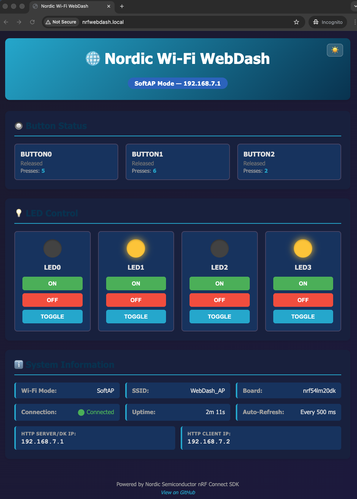

# Nordic Wi-Fi WebDash

[](https://github.com/chshzh/nordic-wifi-webdash/actions/workflows/build.yml)
[](https://www.nordicsemi.com/Products/Development-software/nRF-Connect-SDK)


[](LICENSE)

Nordic Wi-Fi WebDash is a browser-based demo and reference application for Nordic nRF70 Wi-Fi development kits. The device hosts the dashboard itself, so users can monitor buttons, control LEDs, and inspect system state directly from a browser without relying on cloud services.

The firmware supports three Wi-Fi operating modes: SoftAP, STA, and P2P. The selected mode is stored in NVS and can be changed at runtime with the `wifi_mode` shell command.

## Project Overview

### Introduction

This project is designed for two common use cases:

- **Evaluator** — grab a pre-built `.hex` from the [Releases](https://github.com/chshzh/nordic-wifi-webdash/releases) page, flash it, and follow the [Quick Start](#quick-start) guide to reach the dashboard in two steps.
- **Application Developer** — clone the workspace, build from source, and customise the firmware; see [Developer Info](#developer-info) and [pm/PRD.md](pm/PRD.md) for architecture and requirements.

Supported hardware:

- nRF7002DK (`nrf7002dk/nrf5340/cpuapp`)
- nRF54LM20DK + nRF7002EBII (`nrf54lm20dk/nrf54lm20a/cpuapp` + shield)

### Features

- Three Wi-Fi modes: SoftAP, STA, and P2P (Wi-Fi Direct)
- Runtime mode switching with `wifi_mode [SoftAP|STA|P2P]`
- Browser dashboard for button status, LED control, and system information
- REST API for `/api/system`, `/api/buttons`, `/api/leds`, and `/api/led`
- Gzip-compressed static web assets served from flash
- mDNS hostname support via `http://nrfwebdash.local`
- Modular architecture based on SMF + Zbus

### Project Structure

```text
nordic-wifi-webdash/
├── CMakeLists.txt
├── Kconfig
├── prj.conf
├── west.yml
├── boards/
├── pm/
│   ├── PRD.md
│   └── openspec/
├── src/
│   ├── main.c
│   └── modules/
│       ├── button/
│       ├── led/
│       ├── memory/
│       ├── mode_selector/
│       ├── network/
│       ├── webserver/
│       ├── wifi/
│       └── messages.h
└── www/
    ├── index.html
    ├── main.js
    └── styles.css
```

## Quick Start

This section is intentionally short so a non-developer can get to a working dashboard quickly.

### Step 1 - Flash the firmware

Download the pre-built `.hex` for your board from the [Releases](https://github.com/chshzh/nordic-wifi-webdash/releases) page, then open **nRF Connect for Desktop -> Programmer**, select your board, add the `.hex` file, and click **Erase & Write**.

| Board | Release page |
|-------|--------------|
| nRF7002DK | [Latest release](https://github.com/chshzh/nordic-wifi-webdash/releases/latest) |
| nRF54LM20DK + nRF7002EBII | [Latest release](https://github.com/chshzh/nordic-wifi-webdash/releases/latest) |

### Step 2 - Choose Wi-Fi mode and open the dashboard

Open a serial terminal at `115200` baud and follow the instructions printed by the firmware.

- SoftAP: connect to Wi-Fi `WebDash_AP` with password `12345678`, then open `http://192.168.7.1`
- STA: run `wifi_mode STA`, reboot, then run `wifi connect -s <SSID> -p <password> -k 1` and open the `http://<DHCP-IP>` shown in the terminal
- P2P: run `wifi_mode P2P`, reboot, then run `wifi p2p group_add` to start the group and `wifi wps_pin` to get the PIN; on the phone choose Wi-Fi Direct → PIN method and enter the displayed PIN

At any time, you can switch modes with `uart:~$ wifi_mode [SoftAP|STA|P2P]`. The choice is saved to NVS and survives reboot.

## Developer Info

This section keeps only the setup information needed for development. Detailed product behavior, architecture, and acceptance criteria are in [pm/PRD.md](pm/PRD.md).

### Environment Setup

- nRF Connect SDK `v3.3-branch`
- West workspace driven by [west.yml](west.yml)
- nRF Connect for VS Code or a shell initialized with the NCS toolchain

### Build From Source

```bash
# nRF7002DK
west build -p -b nrf7002dk/nrf5340/cpuapp -- -DSNIPPET=wifi-p2p

# nRF54LM20DK + nRF7002EBII
west build -p -b nrf54lm20dk/nrf54lm20a/cpuapp -- -DSNIPPET=wifi-p2p -DSHIELD=nrf7002eb2
```

Flash with:

```bash
west flash
```

### Workspace Setup

This repository is a workspace application. The normal flow is:

1. Initialize the workspace from [west.yml](west.yml).
2. Run `west update`.
3. Build and flash for the target board.

For broader product context and implementation details, refer to [pm/PRD.md](pm/PRD.md) and `pm/openspec/`.

### Configuration

Key application settings are in [prj.conf](prj.conf):

```properties
CONFIG_APP_WIFI_SSID="WebDash_AP"
CONFIG_APP_WIFI_PASSWORD="12345678"
CONFIG_APP_HTTP_PORT=80
CONFIG_NET_HOSTNAME="nrfwebdash"
```

### Developer Notes

- nRF54LM20DK + nRF7002EBII loses one button because of shield pin conflicts; BUTTON0-BUTTON2 remain available
- STA connections are intentionally session-based to avoid unwanted reconnects when returning to SoftAP or P2P
- mDNS behavior, mode handling, and module responsibilities are documented in [pm/PRD.md](pm/PRD.md)

### Troubleshooting

- SoftAP not reachable: verify the terminal shows the expected IP and SoftAP instructions
- STA not reachable: confirm the device received a DHCP IP and use that address first
- mDNS not resolving: test the printed IP before investigating hostname resolution on the host OS
- Build issues: confirm the workspace is using NCS `v3.3-branch` and the correct board/shield combination

## Web Interface



### Button Status Panel

Displays real-time status for all available buttons.

- Current state (Pressed/Released)
- Press count
- Board-aware button naming and count

### LED Control Panel

Provides per-LED control for supported boards.

- `ON`
- `OFF`
- `Toggle`

### System Information

The dashboard also reports:

- active Wi-Fi mode
- SSID
- IP address
- connection status
- uptime

## REST API

All API endpoints use JSON.

### GET /api/system

Returns active mode, IP, SSID, and uptime.

### GET /api/buttons

Returns current button states and press counts.

Example response:

```json
{
  "buttons": [
    {"number": 0, "name": "Button 1", "pressed": false, "count": 5},
    {"number": 1, "name": "Button 2", "pressed": true, "count": 12}
  ]
}
```

### GET /api/leds

Returns current LED states.

Example response:

```json
{
  "leds": [
    {"number": 0, "name": "LED1", "is_on": true},
    {"number": 1, "name": "LED2", "is_on": false}
  ]
}
```

### POST /api/led

Controls a single LED.

Example request:

```json
{
  "led": 1,
  "action": "on"
}
```

Supported actions: `on`, `off`, `toggle`

## References

- [nRF Connect SDK Documentation](https://developer.nordicsemi.com/nRF_Connect_SDK/doc/latest/nrf/index.html)
- [Zephyr State Machine Framework](https://docs.zephyrproject.org/latest/services/smf/index.html)
- [Zephyr Zbus](https://docs.zephyrproject.org/latest/services/zbus/index.html)
- [nRF70 Series WiFi](https://www.nordicsemi.com/Products/nRF7002)
- [PRD](pm/PRD.md)

## Contributing

This project follows Nordic Semiconductor coding standards. Contributions are welcome.

## License

Copyright (c) 2026 Nordic Semiconductor ASA

SPDX-License-Identifier: LicenseRef-Nordic-5-Clause

## Development

This project was developed using [Charlie Skills](https://github.com/chshzh/charlie-skills) with Product Manager and Developer roles for systematic requirements management, architecture design, and implementation.
