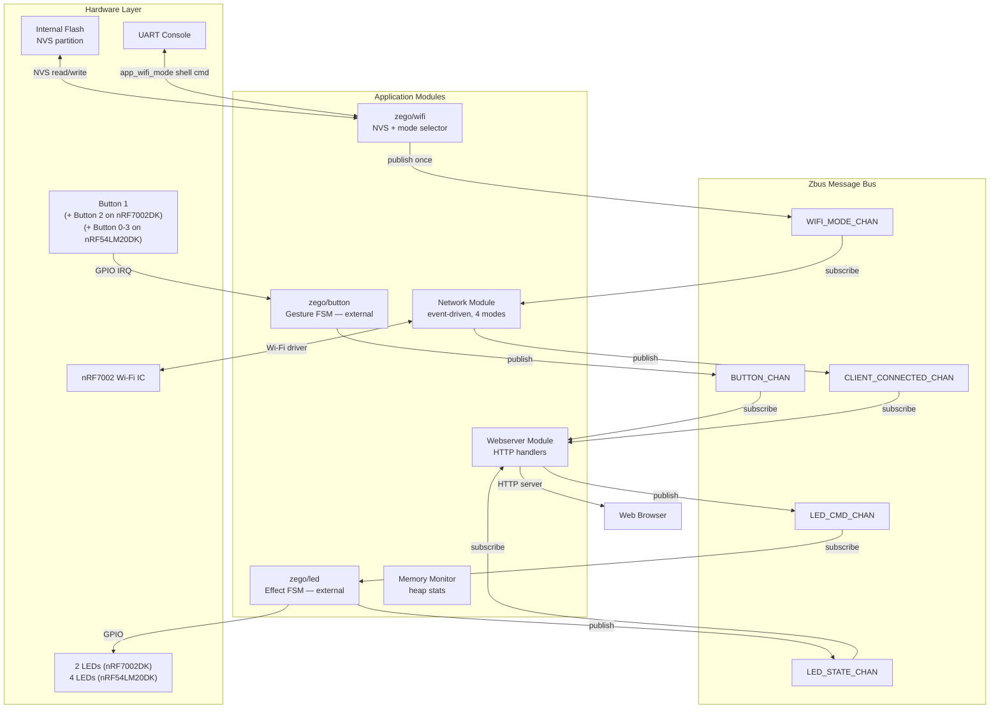

# System Architecture Specification — nordic-wifi-webdash

## Document Information

| Field | Value |
|---|---|
| Project | nordic-wifi-webdash |
| Version | 2026-06-17-14-22 |
| PRD Version | 2026-06-17-14-22 |
| NCS Version | v3.3.0 |
| Target Board(s) | nRF54LM20DK + nRF7002EB2, nRF7002DK |
| Status | Implemented |

## Changelog

| Version | Summary |
|---|---|
| 2026-06-18-13-30 | Migrate `memory/` heap monitor to `zego/bricks/memonitor` brick (`CONFIG_ZEGO_MEMONITOR`, `k_work_delayable`); remove `memory/` from src tree; add `zego/bricks/memonitor` to external modules; replace `app_heap_monitor_init` SYS_INIT row with memonitor entry |
| 2026-06-17-14-22 | Add `ux/` module to module map (from template `app_ux`); add `APP_WIFI_STATE_CHAN` to Zbus channel table; add ux SYS_INIT entry (priority 95); `net_event_app.c` now publishes both `CLIENT_CONNECTED_CHAN` and `APP_WIFI_STATE_CHAN` |
| 2026-05-06-12-00 | Add `SPECS_VERSION` macro in `src/main.c`; printed in startup banner after `Version:` line |
| 2026-06-04-23-00 | Update module map: button, led, mode-selector now shown as external zego modules; remove stale local `mode_selector/` entry |
| 2026-06-04-23-14 | SYS_INIT priorities aligned to zego standard (wifi→41, network→42, button/led→45); renamed ModeSel→ZegoWifi in all diagrams; boot sequence updated for net_event_app.c shim pattern |
| 2026-06-04-23-30 | Added proper Document Information table. |
| 2026-06-05-10-15 | Fix SYS_INIT priority table: correct wifi→0, network→5, button→90, led→91 (the 2026-06-04-23-14 entry incorrectly documented 41/42/45); fix webserver init description — no SYS_INIT, uses static `ZBUS_LISTENER_DEFINE` + `ZBUS_CHAN_ADD_OBS` on `CLIENT_CONNECTED_CHAN` |
| 2026-04-14-10-00 | Code sync: enum app_wifi_mode (4 values, P2P_GO/P2P_CLIENT); WIFI_CHAN → CLIENT_CONNECTED_CHAN; wifi_msg → dk_wifi_info_msg; default mode → P2P_GO; duplicate mode_selector row in module map fixed |
| 2026-04-09-14-00 | Code alignment: fix module map (wifi/ → network/); SYS_INIT priorities (button/led/webserver=90, network=5); button_msg struct (remove duration_ms); boot sequence diagram |
| 2026-04-09-12-00 | Mode selector: remove Button-1 long-press; STA: session-based (no wifi_credentials); P2P: both boards; pbc connect method; updated memory budget |
| 2026-03-31 | v2.0 — multi-mode architecture, Mode Selector module, WIFI_MODE_CHAN |

---

## Overview

Nordic Wi-Fi WebDash uses an **SMF + Zbus modular architecture**. Each feature lives in its own module under `src/modules/`. All inter-module communication is exclusively through Zbus channels. Modules initialize through `SYS_INIT` at priority-ordered boot time.

v2.0 adds a **Mode Selector** module (NVS-backed, shell-command driven) and extends the **Wi-Fi module** to support three runtime-selectable Wi-Fi roles: SoftAP, STA, and P2P (Wi-Fi Direct).

---

## Module Map

```
# App-owned modules (src/modules/)
src/
├── main.c              ← startup banner, SPECS_VERSION macro
└── modules/
    ├── messages.h      ← app-local Zbus message types (dk_wifi_info_msg, app_wifi_mode, app_wifi_state_msg)
    ├── network/        ← net_event_app.c: defines CLIENT_CONNECTED_CHAN + APP_WIFI_STATE_CHAN, overrides __weak hooks
    ├── webserver/      ← HTTP server, REST API, web assets (index.html, main.js, styles.css)
    ├── ux/             ← ux.c: Button 0 gestures + LED 0 Wi-Fi state machine (ported from template)
    └── webserver/      ← HTTP server, REST API, web assets

# External zego modules (registered via EXTRA_ZEPHYR_MODULES in CMakeLists.txt)
../zego/modules/
    ├── button/         ← publishes BUTTON_CHAN (CONFIG_ZEGO_BUTTON=y)
    ├── led/            ← consumes LED_CMD_CHAN, publishes LED_STATE_CHAN (CONFIG_ZEGO_LED=y)
    ├── wifi/           ← app_wifi_mode shell command, NVS persistence, startup banner
    ├── network/        ← Wi-Fi event management backbone (zego_network_on_* weak hooks)
    └── wifi_ble_prov/  ← BLE Wi-Fi credential provisioning (optional)

../zego/bricks/
    └── memonitor/      ← periodic thread + heap watermark sampler (CONFIG_ZEGO_MEMONITOR=y)
```

---

## Zbus Channels

| Channel | Message Type | Publisher | Subscribers | Direction |
|---------|-------------|-----------|-------------|-----------|
| `WIFI_MODE_CHAN` | `struct wifi_mode_msg` | mode_selector | network | boot-time, once |
| `BUTTON_CHAN` | `struct button_msg` | zego/button (external) | webserver, ux | runtime |
| `LED_CMD_CHAN` | `struct led_msg` | webserver, ux | zego/led (external) | runtime |
| `LED_STATE_CHAN` | `struct led_state_msg` | zego/led (external) | webserver | runtime |
| `CLIENT_CONNECTED_CHAN` | `struct dk_wifi_info_msg` | network | webserver | runtime, on connectivity ready |
| `APP_WIFI_STATE_CHAN` | `struct app_wifi_state_msg` | network | ux | runtime, on connectivity change |

### Message Definitions (`src/modules/messages.h`)

```c
/* Wi-Fi operating mode */
enum app_wifi_mode {
    APP_WIFI_MODE_SOFTAP     = 0, /* Device creates own SoftAP */
    APP_WIFI_MODE_STA        = 1, /* Device connects to existing AP */
    APP_WIFI_MODE_P2P_GO     = 2, /* Wi-Fi Direct — device is Group Owner */
    APP_WIFI_MODE_P2P_CLIENT = 3, /* Wi-Fi Direct — device joins phone's group */
};

struct wifi_mode_msg {
    enum app_wifi_mode mode;
};

/* Button events (defined in zego/button/src/button.h) */
enum button_msg_type {
    BUTTON_PRESSED,       /* raw press — duration_ms = 0 */
    BUTTON_RELEASED,      /* raw release — duration_ms = hold time in ms */
    BUTTON_SINGLE_CLICK,  /* confirmed single press (after double-click window) */
    BUTTON_DOUBLE_CLICK,  /* two presses within DOUBLE_CLICK_WINDOW_MS */
    BUTTON_LONG_PRESS,    /* held >= LONG_PRESS_MS (published while still held) */
};

struct button_msg {
    enum button_msg_type type;
    uint8_t  button_number;   /* 0-based DK index */
    uint32_t duration_ms;     /* hold time; semantics depend on type */
    uint32_t press_count;     /* cumulative physical presses for this button */
    uint32_t timestamp;       /* k_uptime_get_32() */
};

/* LED commands (defined in zego/led/src/led.h) */
enum led_msg_type {
    LED_COMMAND_ON,
    LED_COMMAND_OFF,
    LED_COMMAND_TOGGLE,
    LED_COMMAND_BLINK,    /* equal on/off at period_ms each */
    LED_COMMAND_BREATHE,  /* linear fade, full cycle = 2 × period_ms */
    LED_COMMAND_ROTATE,  /* cycle all LEDs in sequence; led_number ignored */
};

struct led_msg {
    enum led_msg_type type;
    uint8_t  led_number; /* 0-based DK index; ignored for ROTATE */
    uint16_t period_ms;  /* effect period; 0 = use Kconfig default */
};

struct led_state_msg {
    uint8_t           led_number; /* 0-based (for ROTATE: first lit LED) */
    bool              is_on;      /* true = on/effect running, false = off */
    enum led_msg_type command;    /* command that triggered this notification */
};

/* DK Wi-Fi connectivity info — published by network module when connection is ready */
struct dk_wifi_info_msg {
    enum app_wifi_mode active_mode; /* Mode that produced this event */
    char dk_ip_addr[16];            /* Device IP (dotted-decimal) */
    char dk_mac_addr[18];           /* Device MAC as XX:XX:XX:XX:XX:XX */
    char ssid[33];                  /* SoftAP/P2P_GO SSID, or connected AP/GO SSID */
    int  error_code;
};
```

---

## SYS_INIT Priority Order

| Priority | Module | Init mechanism | Notes |
|----------|--------|----------------|-------|
| 0 | zego/wifi | `SYS_INIT(mode_selector_init, APPLICATION, 0)` | Reads NVS mode; publishes WIFI_MODE_CHAN; registers `app_wifi_mode` shell command |
| 5 | zego/network | `SYS_INIT(network_module_init, APPLICATION, 5)` | Reads WIFI_MODE_CHAN; registers all net-mgmt event callbacks; calls `net_event_app.c` weak hooks |
| 90 | zego/button | `SYS_INIT(button_module_init, APPLICATION, CONFIG_ZEGO_BUTTON_INIT_PRIORITY)` | GPIO IRQ + gesture FSM setup (default priority 90) |
| 91 | zego/led | `SYS_INIT(led_module_init, APPLICATION, CONFIG_ZEGO_LED_INIT_PRIORITY)` | LED GPIO/PWM setup (default priority 91) |
| 95 | app_ux | `SYS_INIT(app_ux_init, APPLICATION, CONFIG_APP_UX_INIT_PRIORITY)` | Subscribes to BUTTON_CHAN + APP_WIFI_STATE_CHAN; starts LED ROTATE at boot |
| static | webserver | `ZBUS_LISTENER_DEFINE` + `ZBUS_CHAN_ADD_OBS(CLIENT_CONNECTED_CHAN)` | No SYS_INIT — registers a static Zbus listener at link time; starts HTTP server via `k_work_schedule` when the first `CLIENT_CONNECTED_CHAN` event arrives |
| default | zego/memonitor | `SYS_INIT(memonitor_init, APPLICATION, CONFIG_APPLICATION_INIT_PRIORITY)` | Starts `k_work_delayable` that samples thread + heap watermarks every `CONFIG_ZEGO_MEMONITOR_INTERVAL_MS` (default 5 000 ms) |

zego/wifi **must** run before zego/network (priority 0 < 5) because the network module reads the published mode at init time.

---

## System Architecture Diagram



---

## Boot Sequence

```mermaid
sequenceDiagram
    participant HW as Hardware Boot
    participant ZegoWifi as zego/wifi
    participant NVS as NVS Storage
    participant Net as zego/network
    participant Web as Webserver
    participant Btn as zego/button

    HW->>ZegoWifi: SYS_INIT APPLICATION priority 0
    ZegoWifi->>NVS: Read "app/app_wifi_mode"
    alt First boot (no NVS entry)
        NVS-->>ZegoWifi: -ENOENT → use P2P_GO default
    else NVS entry exists
        NVS-->>ZegoWifi: Stored wifi mode (0/1/2)
    end

    ZegoWifi->>WIFI_MODE_CHAN: Publish wifi_mode_msg

    HW->>Net: SYS_INIT APPLICATION priority 5
    Net->>WIFI_MODE_CHAN: Read mode
    Net->>Net: Registers net_mgmt event callbacks; starts Wi-Fi path
    Net->>Net: Calls net_event_app.c hooks on connectivity events

    HW->>Btn: SYS_INIT APPLICATION priority 90
    Btn->>Btn: Setup GPIO IRQs (dk_buttons_init)

    Note over Web: Webserver: static ZBUS_LISTENER_DEFINE registered at link time
    Note over Net,Web: Web server starts (via k_work_schedule) when CLIENT_CONNECTED_CHAN is published
```

---

## Wi-Fi Mode Paths

### SoftAP Path (mode = 0)

- Kconfig: `CONFIG_NRF70_AP_MODE=y`, `CONFIG_WIFI_NM_WPA_SUPPLICANT_AP=y`
- Static IP: `192.168.7.1/24`
- DHCP server: leases `192.168.7.2–192.168.7.3` (max 2 clients)
- HTTP server: `http://192.168.7.1` or `http://nrfwebdash.local`
- Wi-Fi SSID: `CONFIG_APP_WIFI_SSID` (default `WebDash_AP`)

### STA Path (mode = 1)

- Kconfig: `CONFIG_WIFI_NM_WPA_SUPPLICANT=y`; conn_mgr auto-connect disabled
- Connection: session-based via `wifi connect -s <SSID> -p <pwd> -k 1` shell command
- IP: DHCP-assigned from AP
- HTTP server: `http://<dhcp-ip>` or `http://nrfwebdash.local`

### P2P Path (mode = 2, both boards)

- Kconfig: `CONFIG_NRF70_P2P_MODE=y`, `CONFIG_WIFI_NM_WPA_SUPPLICANT_P2P=y`
- Build: `-DSNIPPET=wifi-p2p` snippet required (both boards)
- Auto-start: `wifi p2p find` on boot
- Role: Group Interface (GI/client); phone acts as Group Owner (GO)
- IP: DHCP-assigned from phone's P2P group
- HTTP server: `http://<p2p-dhcp-ip>`
- Connection workflow (WCS-106):
  1. Device auto-starts `wifi p2p find`
  2. User runs `wifi p2p peer` to list discovered peers
  3. User runs `wifi p2p connect <MAC> pbc -g 0`
  4. User accepts on phone
  5. DHCP IP received from phone → `WIFI_P2P_CONNECTED` published

---

## Board Capability Matrix

| Capability | nRF54LM20DK + nRF7002EBII | nRF7002DK |
|------------|---------------------------|-----------|
| Total buttons | 3 (BUTTON 3 unavailable due to shield) | 2 |
| LEDs | 4 | 2 |
| SoftAP mode | Yes | Yes |
| STA mode | Yes | Yes |
| P2P mode | Yes (with -DSNIPPET=wifi-p2p) | Yes (with -DSNIPPET=wifi-p2p) |

---

## Memory Budget

### Baseline (v1.0 SoftAP only)

| Component | Flash | RAM |
|-----------|-------|-----|
| Wi-Fi Stack (SoftAP) | ~65 KB | ~50 KB |
| HTTP Server | ~25 KB | ~20 KB |
| SMF/Zbus | ~10 KB | ~5 KB |
| Application Modules | ~15 KB | ~10 KB |
| **Total** | **~115 KB** | **~85 KB** |

### v2.0 Additions

| New Feature | Flash | RAM | Notes |
|-------------|-------|-----|-------|
| Mode Selector + NVS | +8 KB | +3 KB | Settings + NVS + Flash storage |
| Wi-Fi STA path | +0 KB | +0 KB | Session-based; supplicant already linked; no wifi_credentials |
| P2P extensions | +5 KB | +3 KB | wpa_supplicant P2P (in -DSNIPPET=wifi-p2p build only) |
| Webserver `/api/system` | +1 KB | +0 KB | Small handler addition |
| **v2.0 Total Delta** | **+13 KB** | **+6 KB** | P2P build adds ~5 KB flash |

Estimated v2.0 total (SoftAP/STA build): ~128 KB Flash, ~91 KB RAM
Estimated v2.0 total (P2P build): ~133 KB Flash, ~94 KB RAM

Available budget (nRF5340 app core): 1 MB Flash, 448 KB RAM — margins are comfortable.

---

## Related Specs

- [network-module.md](network-module.md) — SoftAP/STA/P2P paths, event flows, Kconfig
- [zego/led ↗](https://github.com/chshzh/zego/blob/main/modules/led/docs/led-spec.md) — LED control, Effect FSM, LED_CMD_CHAN / LED_STATE_CHAN
- [zego/wifi ↗](https://github.com/chshzh/zego/blob/main/modules/wifi/docs/wifi-spec.md) — boot window logic, NVS, shell menu
- [zego/button ↗](https://github.com/chshzh/zego/blob/main/modules/button/docs/button-spec.md) — GPIO button monitoring, gesture FSM, BUTTON_CHAN
- [webserver-module.md](webserver-module.md) — mode-aware HTTP server, `/api/system`
