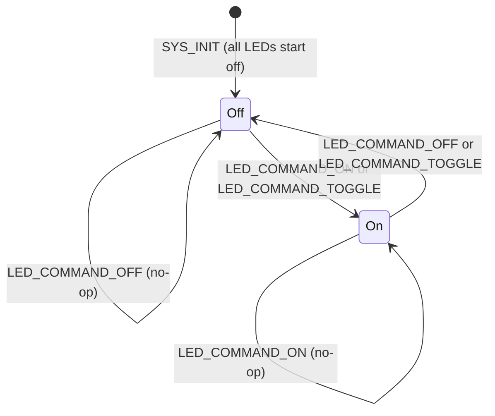

# LED Module Specification

> **PRD Version**: 2026-04-09-12-00

## Changelog

| Version | Summary |
|---|---|
| 2026-04-09-14-00 | Initial spec — reverse-designed from src/modules/led/led.c |

---

## Overview

The LED module provides runtime LED control for the WebDash. It exposes
two Zbus channels — one for incoming commands (`LED_CMD_CHAN`) and one for
publishing current LED state (`LED_STATE_CHAN`). Each LED is managed by a
2-state SMF (Off / On). The webserver REST API sends `LED_CMD_CHAN` messages;
the webserver also subscribes to `LED_STATE_CHAN` to keep its `/api/leds`
response current.

The number of LEDs available is determined at compile time by `APP_NUM_LEDS`
(defined in `messages.h`): 2 on nRF7002DK, 4 on nRF54LM20DK + nRF7002EBII.

---

## File Location

```
src/modules/led/
├── led.c           ← SMF + Zbus integration + SYS_INIT
├── led.h           ← public API
└── Kconfig.led     ← module Kconfig (log level)
```

---

## Zbus Integration

### Channels

| Channel | Direction | Message type | Description |
|---------|-----------|--------------|-------------|
| `LED_CMD_CHAN` | Subscribe | `struct led_msg` | Receives LED control commands (ON / OFF / TOGGLE) |
| `LED_STATE_CHAN` | Publish | `struct led_state_msg` | Publishes current LED state after each state change |

### Message Definitions (`src/modules/messages.h`)

```c
enum led_msg_type {
    LED_COMMAND_ON,
    LED_COMMAND_OFF,
    LED_COMMAND_TOGGLE,
};

struct led_msg {
    enum led_msg_type type;
    uint8_t led_number;   /* 0-based DK index */
};

struct led_state_msg {
    uint8_t led_number;
    bool    is_on;
};
```

---

## State Machine

Each of the `APP_NUM_LEDS` LEDs has its own independent 2-state SMF instance.



### State actions

| State | Entry action | Run action |
|-------|-------------|------------|
| Off | `dk_set_led_off(n)`; publish `LED_STATE_CHAN` (is_on=false) | Check `has_pending_command`; if ON or TOGGLE → transition to On |
| On  | `dk_set_led_on(n)`; publish `LED_STATE_CHAN` (is_on=true) | Check `has_pending_command`; if OFF or TOGGLE → transition to Off |

Commands are delivered via the Zbus listener (`led_cmd_listener`) which sets
`pending_command` and `has_pending_command` on the target LED's SM object, then
calls `smf_run_state()` directly in the listener callback. No separate thread
is required.

---

## Kconfig Flags

| Symbol | Description | Default |
|--------|-------------|---------|
| `CONFIG_LED_MODULE_LOG_LEVEL` | Log level for `led_module` | `LOG_LEVEL_INF` |

---

## Public API

```c
/* Automatically called by SYS_INIT — do not call manually */
int led_module_init(void);

/* Get current state of a single LED */
int led_get_state(uint8_t led_number, bool *state);
/* Returns 0 on success, -EINVAL if led_number >= APP_NUM_LEDS */

/* Render all LED states as a JSON object */
int led_get_all_states_json(char *buf, size_t buf_len);
/* Returns bytes written, or negative error code.
 * Format: {"leds":[{"number":0,"name":"LED1","is_on":false}, ...]} */
```

---

## Boot Sequence

Initializes at `SYS_INIT APPLICATION priority 90` (`CONFIG_APPLICATION_INIT_PRIORITY`):

1. `dk_leds_init()` — initialises all DK LEDs via the hardware abstraction layer
2. For each LED 0…`APP_NUM_LEDS-1`:
   - Set initial state: Off
   - Initialise SMF context with Off as starting state
   - Call `smf_run_state()` to execute the Off entry action (turns GPIO low, publishes state)
3. Register Zbus listener on `LED_CMD_CHAN`

Log output on successful boot:
```
[led] Initializing LED module
[led] LED module initialized
```

---

## Error Handling

| Condition | Behaviour |
|-----------|-----------|
| `dk_leds_init()` fails | Log error, return negative code; SYS_INIT marks module failed |
| `led_number >= APP_NUM_LEDS` in command | Log warning, ignore command |
| `led_get_state()` with invalid args | Return `-EINVAL` |
| `led_get_all_states_json()` buffer too small | Return `-ENOMEM` |
| `smf_run_state()` returns error | Log error, continue (LED state may be inconsistent) |

---

## Memory Estimate

| Item | Flash | RAM |
|------|-------|-----|
| Code + constants | ~2 KB | — |
| `led_sm[]` array (2 LEDs) | — | ~72 B |
| `led_sm[]` array (4 LEDs) | — | ~144 B |
| Stack (no dedicated thread) | — | 0 B |

The LED module runs entirely within the Zbus listener context (system work queue).
No dedicated thread or stack allocation is needed.

---

## Test Points

Expected UART log output during normal operation:

```
[led] Initializing LED module
[led] LED module initialized
[led] LED1 turned ON          ← on LED_COMMAND_ON for LED 0
[led] LED1 turned OFF         ← on LED_COMMAND_OFF for LED 0
```

REST-driven verification:
1. `POST /api/led` with `{"led": 0, "action": "on"}` → LED 0 turns on; `GET /api/leds` returns `"is_on": true`
2. `POST /api/led` with `{"led": 0, "action": "toggle"}` → LED 0 turns off
3. `POST /api/led` with `{"led": 99, "action": "on"}` → warning logged, no crash

---

## Board Differences

| Board | `APP_NUM_LEDS` | LED labels |
|-------|---------------|------------|
| nRF7002DK | 2 | `LED1`, `LED2` |
| nRF54LM20DK + nRF7002EBII | 4 | `LED0`, `LED1`, `LED2`, `LED3` |

---

## Related Specs

- [architecture.md](architecture.md) — Zbus channels, SYS_INIT priority ordering
- [webserver-module.md](webserver-module.md) — publishes `LED_CMD_CHAN`; subscribes `LED_STATE_CHAN`
