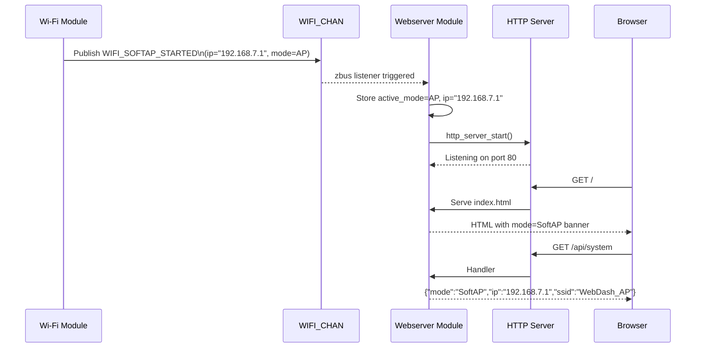

# Webserver Module Specification

## Document Information

| Field | Value |
|---|---|
| Project | nordic-wifi-webdash |
| Version | 2026-06-19-13-12 |
| PRD Version | 2026-06-19-13-12 |
| NCS Version | v3.3.0 |
| Target Board(s) | nRF54LM20DK + nRF7002EB2, nRF7002DK |
| Status | Implemented |

## Changelog

| Version | Summary |
|---|---|
| 2026-06-19-13-12 | PRD Version updated to 2026-06-19-13-12. Sysmon polling: add `sysmonInFlight` concurrency guard; sysmon pauses when browser tab is hidden (Page Visibility API) and resumes with immediate fetch on visibility. |
| 2026-06-18-13-36 | Change `SYSMON_INTERVAL` from 2 000 ms to 5 000 ms to match `CONFIG_ZEGO_MEMONITOR_INTERVAL_MS` (no benefit polling faster than firmware samples) |
| 2026-06-18-13-30 | Migrate sysmon backend to `zego/bricks/memonitor` (`CONFIG_ZEGO_MEMONITOR`, `<memonitor.h>`); fix endpoint name `/api/heap` → `/api/heaps`; remove stale `src/modules/memory/heap_monitor.c` reference; update auto-refresh: `/api/system` now fetched once at load + every 30 s (local uptime incremented every 1 s between fetches), buttons/LEDs remain 500 ms |
| 2026-06-17-14-22 | Add FR-107 `GET /api/threads` (k_thread_foreach + k_thread_runtime_stats_get) and FR-108 `GET /api/heap` (sys_heap_runtime_stats_get on _system_heap); add Thread and Heap panels to web UI (2 s poll); Kconfig: THREAD_RUNTIME_STATS + SYS_HEAP_RUNTIME_STATS |
| 2026-04-17-10-00 | Add dark mode (FR-105): CSS `prefers-color-scheme` auto-detect + manual toggle button; no persistence; all UI elements legible in both modes |
| 2026-06-04-23-30 | Added proper Document Information table; PRD Version aligned to 2026-06-04-23-14. |
| 2026-04-14-10-00 | Code sync: subscribes to CLIENT_CONNECTED_CHAN (not WIFI_CHAN); /api/system fields updated (device_ip, device_mac, client_ip, board); client IP tracked in all modes via zsock_getpeername(); MAX_WEB_CLIENTS=4; mode values include P2P_GO/P2P_CLIENT |
| 2026-04-09-14-00 | Code alignment: fix DNS-SD macro to `DNS_SD_REGISTER_SERVICE` (not `DNS_SD_REGISTER_TCP_SERVICE`) |
| 2026-04-09-12-00 | Add DNS-SD `_http._tcp.local` service registration (FR-104) |
| 2026-03-31 | v2.0 — mode-aware dashboard, `/api/system` endpoint |

---

## Overview

The Webserver module serves the WebDash over HTTP and exposes a JSON REST API for device state control. It is **mode-aware**: it shows the active Wi-Fi mode in the UI banner and provides a `/api/system` endpoint that returns mode, IP address, and SSID.

The module subscribes to `WIFI_CHAN` to know when the network is ready and what IP/mode is active, `BUTTON_CHAN` for button state polling, and `LED_STATE_CHAN` for LED state.

---

## Location

- **Path**: `src/modules/webserver/`
- **Files**: `webserver.c`, `webserver.h`, `Kconfig.webserver`, `CMakeLists.txt`

---

## Zbus Integration

**Subscribes to**:
- `CLIENT_CONNECTED_CHAN` — to know when to start the HTTP server and what mode/IP/MAC/SSID is active
- `BUTTON_CHAN` — caches latest button states for `/api/buttons`
- `LED_STATE_CHAN` — caches latest LED states for `/api/leds`

**Publishes to**:
- `LED_CMD_CHAN` — when `POST /api/led` is received

---

## HTTP Server Startup

The HTTP server starts after receiving a `CLIENT_CONNECTED_CHAN` message (any mode). Server start is deferred via `k_work_schedule` with `K_NO_WAIT` from the Zbus listener; `MAX_WEB_CLIENTS = 4` to allow parallel asset fetches at page load.

| Mode | Server starts on | Access URL |
|------|-----------------|------------|
| SoftAP | First STA joins (`AP_STA_CONNECTED`) | `http://192.168.7.1` or `http://nrfwebdash.local` |
| STA | DHCP bound | `http://<dhcp-ip>` or `http://nrfwebdash.local` |
| P2P_GO | First peer joins (`AP_STA_CONNECTED`) | `http://<go-ip>` |
| P2P_CLIENT | DHCP bound (from phone's server) | `http://<p2p-ip>` (mDNS may not work on all phones) |

---

## DNS-SD Service Registration

On HTTP server start the module registers an `_http._tcp.local` DNS-SD service record so that zero-conf browsers and discovery tools (e.g. Bonjour, Avahi, iOS/Android service browsers) find the device automatically without knowing its IP.

```c
#include <zephyr/net/dns_sd.h>

static const uint16_t http_dns_sd_port = sys_cpu_to_be16(CONFIG_APP_HTTP_PORT);

DNS_SD_REGISTER_SERVICE(webdash_http, CONFIG_NET_HOSTNAME,
                         "_http", "_tcp", "local",
                         DNS_SD_EMPTY_TXT, &http_dns_sd_port);
```

This works in conjunction with `CONFIG_MDNS_RESPONDER=y` so the device is reachable both by:  
- Hostname: `http://nrfwebdash.local` (mDNS A record)  
- Service: `_http._tcp.local` (DNS-SD PTR/SRV/TXT records)

---

## REST API Endpoints

### GET /api/system 

Returns current Wi-Fi mode, IP address, and SSID.

**Response**:
```json
{
  "mode": "SoftAP",
  "device_ip": "192.168.7.1",
  "device_mac": "AA:BB:CC:DD:EE:FF",
  "client_ip": "192.168.7.100",
  "ssid": "WebDash_AP",
  "uptime_s": 42,
  "board": "nrf54lm20dk"
}
```

`mode` values: `"SoftAP"`, `"STA"`, `"P2P_GO"`, `"P2P_CLIENT"`

`client_ip`: IP of the HTTP client (browser) as seen by the server socket, via `zsock_getpeername()`. Updated on every API request in all modes. Returns `"0.0.0.0"` until first request.

---

### GET /api/buttons

Returns current state of all buttons.

**Response**:
```json
{
  "buttons": [
    {"number": 0, "name": "Button 1", "pressed": false, "count": 5},
    {"number": 1, "name": "Button 2", "pressed": true,  "count": 12}
  ]
}
```

Board-adaptive: nRF54LM20DK returns 3 entries; nRF7002DK returns 2 entries.

---

### GET /api/leds

Returns current state of all LEDs.

**Response**:
```json
{
  "leds": [
    {"number": 0, "name": "LED1", "is_on": true},
    {"number": 1, "name": "LED2", "is_on": false}
  ]
}
```

Board-adaptive: nRF54LM20DK returns 4 entries; nRF7002DK returns 2 entries.

---

### POST /api/led

Controls a specific LED.

**Request**:
```json
{"led": 0, "action": "on"}
```

**Actions**: `"on"`, `"off"`, `"toggle"`

**Response**: `200 OK` on success; `400 Bad Request` on invalid parameters.

---

### GET /api/threads

Returns runtime stats for all live Zephyr threads (FR-107).

**Implementation**: `k_thread_foreach()` iterates all threads; `k_thread_runtime_stats_get()` provides CPU cycle counts; CPU% is derived by comparing `execution_cycles` delta between calls (not implemented in first version — returns 0 until a background accumulation mechanism is added; field reserved).

**Kconfig required**: `CONFIG_THREAD_RUNTIME_STATS=y`, `CONFIG_THREAD_RUNTIME_STATS_USE_TIMING_FUNCTIONS=y`

**Response**:
```json
{
  "threads": [
    {"name": "shell_uart", "state": "pending", "cpu_pct": 0, "stack_used": 1024, "stack_size": 2048},
    {"name": "net_mgmt",   "state": "pending", "cpu_pct": 0, "stack_used": 768,  "stack_size": 1024}
  ]
}
```

`state` values: `"running"`, `"ready"`, `"pending"`, `"dead"`, `"suspended"`

Stack bar in the UI turns amber when `stack_used / stack_size >= 0.80`.

---

### GET /api/heaps

Returns system heap usage statistics (FR-108).

**Implementation**: `sys_heap_runtime_stats_get()` on the kernel `_system_heap`.
Backend sampling provided by `zego/bricks/memonitor` (`CONFIG_ZEGO_MEMONITOR=y`, include `<memonitor.h>`).

**Kconfig required**: `CONFIG_SYS_HEAP_RUNTIME_STATS=y`, `CONFIG_ZEGO_MEMONITOR=y`

**Response**:
```json
{
  "allocated_bytes": 8192,
  "free_bytes": 24576,
  "peak_allocated_bytes": 10240,
  "max_allocated_bytes": 4096
}
```

Progress bar in the UI: used / total. Turns amber at ≥ 70%, red at ≥ 90%. 

### Mode Banner

A new header banner shows the active Wi-Fi mode with color coding:

| Mode | Badge color | Label |
|------|-------------|-------|
| SoftAP | Blue | `SoftAP — 192.168.7.1` |
| STA | Green | `STA — <IP>` |
| P2P_GO | Purple | `P2P_GO — <IP>` |
| P2P_CLIENT | Orange | `P2P_CLIENT — <IP>` |

### Existing Panels (unchanged)

- Button Status Panel: press state, count, animation
- LED Control Panel: ON/OFF/Toggle per LED
- System Information: SSID, IP, refresh rate

### Thread Monitor Panel (FR-107)

A collapsible card below the System Information panel titled **"Thread Monitor"**.

- Polls `GET /api/threads` every 5 000 ms via `setInterval`.
- Renders a table: `Name | State | CPU% | Stack Used | Stack Size | Bar`.
- Stack bar is a `<progress>`-like element; turns amber (CSS `--warn`) when `stack_used / stack_size ≥ 0.80`.
- Poll uses a separate interval from the 500 ms system/button/LED poll to avoid overloading the HTTP server.

### Heap Monitor Panel (FR-108)

A collapsible card below the Thread Monitor panel titled **"Heap Monitor"**.

- Polls `GET /api/heaps` every 5 000 ms (shared interval with Thread Monitor).
- Renders: allocated / total bar, and a text row of `allocated | free | peak | max_alloc` values.
- Bar turns amber at ≥ 70% used, red at ≥ 90% used.

### Auto-Refresh

| Resource | Interval | Notes |
|----------|----------|-------|
| `/api/buttons`, `/api/leds` | 500 ms | `setInterval` loop |
| `/api/system` | Once at load, then every 30 s | `startSystemUpdate()`; uptime incremented locally every 1 s between fetches |
| `/api/threads`, `/api/heaps` | 5 000 ms | `setInterval(updateSysmon, SYSMON_INTERVAL)` — matches `CONFIG_ZEGO_MEMONITOR_INTERVAL_MS` (default 5 000 ms) |

### Dark Mode (FR-105)

The UI supports light and dark colour schemes.

**Auto-detect (default)**  
A CSS `@media (prefers-color-scheme: dark)` block applies the dark palette automatically when the browser/OS is in dark mode. No JavaScript is required for the default path.

**Manual toggle**  
A sun/moon icon button in the page header lets the user override the system setting for the current session.

- Clicking the button adds or removes a `data-theme="dark"` attribute on `<html>`.
- CSS uses `html[data-theme="dark"] { ... }` selectors, which take precedence over the media query.
- The toggle resets on page reload (no `localStorage`).

**Colour tokens** (CSS custom properties):

| Token | Light value | Dark value |
|-------|-------------|------------|
| `--bg` | `#ffffff` | `#1a1a2e` |
| `--bg-panel` | `#f4f4f4` | `#16213e` |
| `--text` | `#111111` | `#e0e0e0` |
| `--border` | `#cccccc` | `#444466` |
| `--accent` | *(mode badge colours unchanged)* | *(mode badge colours unchanged)* |

All existing UI elements — mode banner badges, button state indicators, LED control buttons, system information table — use these tokens. No element uses hardcoded colour values.

**Implementation notes**:
- All colour declarations in `styles.css` must use `var(--<token>)`.
- The toggle button HTML is a `<button id="theme-toggle">` in the `<header>`.
- Approximately 5–8 lines of JavaScript handle the click event and attribute mutation.
- No server-side changes required; this is purely a static file change.

---

## Sequence Diagram — Mode-Aware Startup



---

## Kconfig Options

```kconfig
config APP_WEBSERVER_MODULE
    bool "Enable Webserver Module"
    default y
    select HTTP_SERVER
    select HTTP_PARSER
    select JSON_LIBRARY

config APP_HTTP_PORT
    int "HTTP server port"
    default 80
    depends on APP_WEBSERVER_MODULE

config APP_WEBSERVER_MODULE_LOG_LEVEL
    int "Webserver module log level"
    default 3   # LOG_LEVEL_INF
    depends on APP_WEBSERVER_MODULE
```

---

## Memory Footprint

| Component | Flash | RAM |
|-----------|-------|-----|
| webserver.c (handlers) | ~8 KB | ~5 KB |
| HTTP server (Zephyr) | ~25 KB | ~20 KB |
| JSON library | ~5 KB | ~2 KB |
| www/ static files (index.html, main.js, styles.css) | ~12 KB Flash | 0 (served from flash) |
| **Total** | **~48 KB** | **~27 KB** |

---

## Log Output Examples

```
[00:00:06.001] <inf> webserver: WIFI_SOFTAP_STARTED received — mode=SoftAP ip=192.168.7.1
[00:00:06.005] <inf> webserver: HTTP server started on port 80
[00:00:10.123] <inf> webserver: GET /api/system
[00:00:10.125] <inf> webserver: POST /api/led {"led":0,"action":"toggle"}
[00:00:10.127] <inf> webserver: LED 0 toggled
```

---

## Testing

### TC-WEB-001: Dashboard loads in SoftAP mode

1. Boot in SoftAP mode
2. Connect phone to `WebDash_AP`
3. Navigate to `http://192.168.7.1`
4. Verify mode banner shows `SoftAP Mode — 192.168.7.1`

### TC-WEB-002: Dashboard loads in STA mode

1. Run `app_wifi_mode STA` and reboot
2. Run `wifi connect -s "TestAP" -p "password" -k 1` via shell
3. Note DHCP IP from logs
4. Navigate to `http://<dhcp-ip>` or `http://nrfwebdash.local`
5. Verify mode banner shows `Station Mode — <IP>`

### TC-WEB-003: Dashboard loads in P2P mode

1. Boot in P2P mode; complete P2P connection via shell
2. Note P2P IP from logs (e.g., `192.168.49.x`)
3. Navigate to `http://192.168.49.x` from phone browser
4. Verify mode banner shows `P2P Direct — 192.168.49.x`

### TC-WEB-004: GET /api/system

```bash
curl http://192.168.7.1/api/system
# Expected: {"mode":"SoftAP","ip":"192.168.7.1","ssid":"WebDash_AP","uptime_s":15}
```

### TC-WEB-005: LED and button API (regression)

1. GET `/api/buttons` — verify count of entries matches board
2. GET `/api/leds` — verify count of entries matches board
3. POST `/api/led` with `{"led":0,"action":"toggle"}` — verify LED changes

### TC-WEB-006: Dark mode

1. Open the dashboard in a browser set to dark mode (`prefers-color-scheme: dark`)
2. Verify page background is dark (`--bg` token applied)
3. Verify all text and UI elements are legible (no invisible text or missing borders)
4. Click the theme toggle button in the header
5. Verify the page switches to light mode without a reload
6. Set the browser to light mode; reload the page
7. Verify light mode is shown (toggle override did not persist)

---

## Related Specs

- [architecture.md](architecture.md) — Zbus channels overview
- [network-module.md](network-module.md) — WIFI_CHAN events that trigger server start
- zego/button (external module) — BUTTON_CHAN events cached by webserver (see [button-spec.md](https://github.com/chshzh/zego/blob/main/button/docs/button-spec.md))
