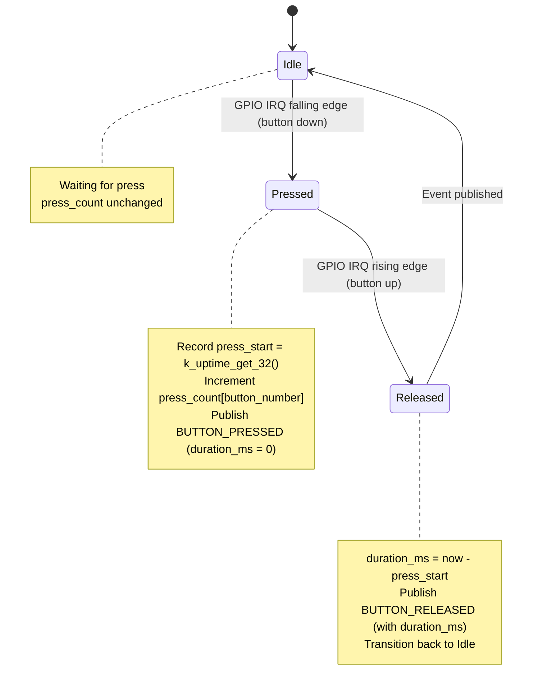
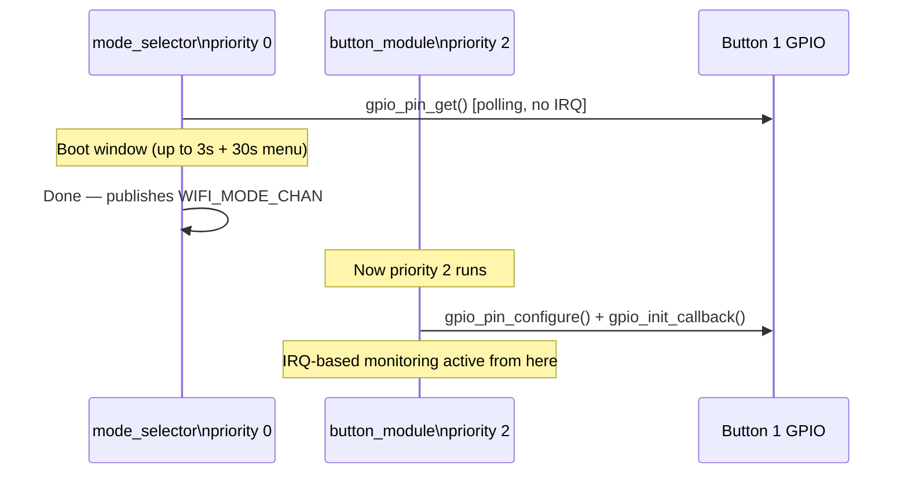

# Button Module Specification — v2.0

## Overview

The Button module provides runtime GPIO button monitoring using the SMF (State Machine Framework). It detects press/release events, tracks press counts and durations, and publishes events via `BUTTON_CHAN`.

In v2.0 the module is updated to:

1. **Not conflict with mode_selector boot sampling** — mode_selector polls Button 1 GPIO directly during `SYS_INIT` priority 0 before the button module registers IRQs at priority 2.
2. **Add `duration_ms` to button events** — the webserver and future modules can distinguish short vs. long presses at runtime.
3. **Expose `is_boot_long_press` flag** — set on the first event after boot if the button was the one used for mode selection (informational only; mode_selector already handled the action).

---

## Location

- **Path**: `src/modules/button/`
- **Files**: `button.c`, `button.h`, `Kconfig.button`, `CMakeLists.txt`

---

## Hardware

| Board | Available Buttons | DK Index | Silk Print |
|-------|------------------|----------|------------|
| nRF7002DK | 2 | 0, 1 | Button 1, Button 2 |
| nRF54LM20DK + nRF7002EBII | 3 | 0, 1, 2 | BUTTON 0, BUTTON 1, BUTTON 2 |

> Note: BUTTON 3 on nRF54LM20DK is unavailable when using nRF7002EBII shield (pin conflict with UART30).

---

## Zbus Integration

**Publishes**: `BUTTON_CHAN`

```c
struct button_msg {
    enum button_msg_type type;       /* BUTTON_PRESSED or BUTTON_RELEASED */
    uint8_t  button_number;          /* 0-based DK index */
    uint32_t duration_ms;            /* press duration (0 on PRESSED event) */
    uint32_t press_count;            /* total presses since boot, per button */
    uint32_t timestamp;              /* k_uptime_get_32() */
    bool     is_boot_long_press;     /* true if this was the mode-select hold */
};
```

**Subscribers**: `webserver` module reads button state via polling the last message.

---

## State Machine



---

## Boot Interaction with Mode Selector

The button module initializes at `SYS_INIT` priority **2** — after mode_selector (priority 0) has already completed its boot-window polling.

This means:
- mode_selector reads Button 1 GPIO **directly** using `gpio_pin_get()` with no IRQ
- button module later registers GPIO callbacks (falling/rising edge) for runtime events
- The first button event the button module sees is whatever happens *after* boot completes

There is **no conflict** because mode_selector exits before button module registers its callbacks.



---

## Debouncing

Software debounce using a 50 ms ignore window after the first edge:

```c
#define BUTTON_DEBOUNCE_MS  50
```

After a falling edge, any additional edges within 50 ms are ignored.

---

## Kconfig Options

```kconfig
config APP_BUTTON_MODULE
    bool "Enable Button Module"
    default y
    select DK_LIBRARY
    select GPIO

config APP_BUTTON_COUNT
    int "Number of buttons to monitor"
    default 2 if BOARD_NRF7002DK_NRF5340_CPUAPP
    default 3 if BOARD_NRF54LM20DK_NRF54LM20A_CPUAPP
    range 1 4
    depends on APP_BUTTON_MODULE
    help
      Set to match the number of available buttons on the target board.
      nRF7002DK has 2 buttons. nRF54LM20DK+nRF7002EBII has 3 usable buttons
      (BUTTON 3 conflicts with nRF7002EBII shield UART30).

config APP_BUTTON_DEBOUNCE_MS
    int "Button debounce time in ms"
    default 50
    depends on APP_BUTTON_MODULE

config APP_BUTTON_MODULE_LOG_LEVEL
    int "Button module log level"
    default 3   # LOG_LEVEL_INF
    depends on APP_BUTTON_MODULE
```

---

## Log Output Examples

```
[00:00:00.800] <inf> button: Button module initialized (2 buttons monitored)
[00:00:05.120] <inf> button: Button 1 (index 0) pressed
[00:00:05.420] <inf> button: Button 1 (index 0) released, duration=300ms, count=1
[00:00:06.100] <inf> button: Button 2 (index 1) pressed
[00:00:06.900] <inf> button: Button 2 (index 1) released, duration=800ms, count=1
```

---

## Memory Footprint

| Component | Flash | RAM |
|-----------|-------|-----|
| button.c (SMF + IRQ) | ~2 KB | ~1 KB |
| DK Library (shared) | ~3 KB | ~1 KB |

---

## Testing

### TC-BTN-001: Press and release detection

1. Flash firmware; open serial console
2. Press and release Button 1
3. Verify logs: `BUTTON_PRESSED` → `BUTTON_RELEASED` with `duration_ms > 0`
4. Verify `press_count` increments each press

### TC-BTN-002: Multiple buttons

1. Press all available buttons in sequence
2. Verify each button reports correct `button_number` (0-based)
3. Verify press counts are independent per button

### TC-BTN-003: No conflict with mode selector

1. Boot with Button 1 held (triggers mode selector)
2. After mode menu appears, release button
3. Verify button module starts normally after mode selection completes
4. Verify subsequent presses are detected correctly by button module

### TC-BTN-004: Board button count

1. nRF7002DK: verify only 2 buttons monitored; no IRQ registered for index 2+
2. nRF54LM20DK: verify 3 buttons monitored; BUTTON 3 (index 3) not registered

---

## Related Specs

- [architecture.md](architecture.md) — Zbus channels, SYS_INIT priority ordering
- [mode-selector.md](mode-selector.md) — boot-time Button 1 polling (runs before this module)
- [webserver-module.md](webserver-module.md) — reads button state for REST API
