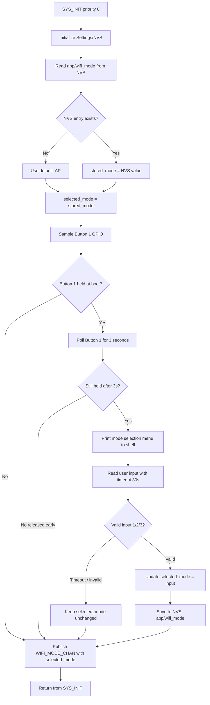
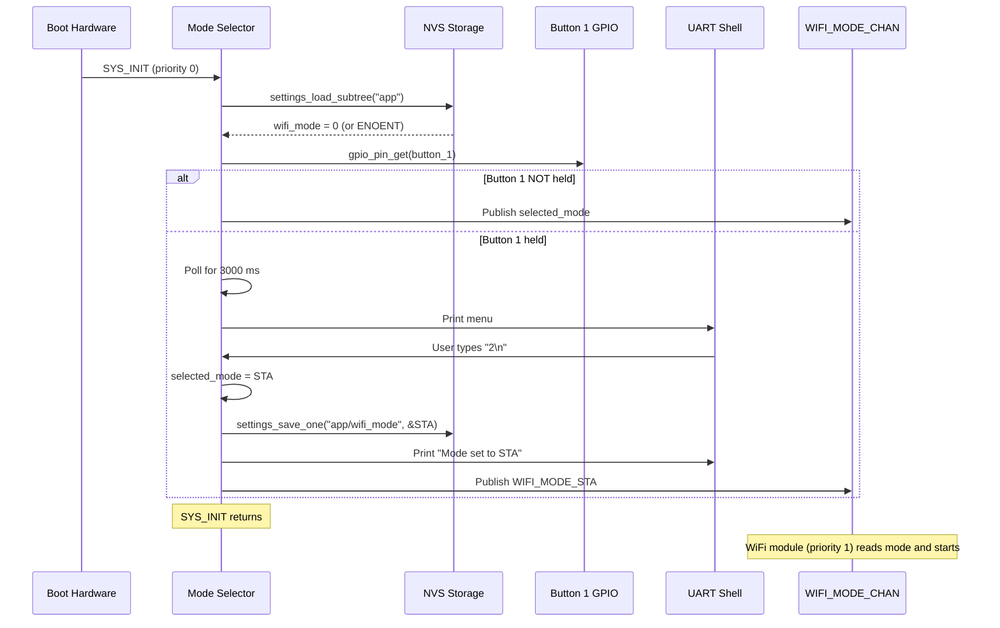

# Mode Selector Module Specification — v2.0 (New)

## Overview

The Mode Selector module runs at the earliest `SYS_INIT` priority (0) and is responsible for:

1. Reading the persisted Wi-Fi mode from NVS on every boot
2. Detecting if the user holds **Button 1** (DK index 0) for more than 3 seconds during the boot window
3. If held: presenting a numbered shell menu and reading user input (1/2/3)
4. Saving the selected mode to NVS
5. Publishing the resolved mode on `WIFI_MODE_CHAN` so the WiFi module (priority 1) can initialize the correct path

This module guarantees that `WIFI_MODE_CHAN` is populated **before** the WiFi module's `SYS_INIT` runs.

---

## Location

- **Path**: `src/modules/mode_selector/`
- **Files**: `mode_selector.c`, `mode_selector.h`, `Kconfig.mode_selector`, `CMakeLists.txt`

---

## Zbus Integration

**Publishes**: `WIFI_MODE_CHAN` once at boot

```c
struct wifi_mode_msg { enum wifi_mode mode; };
```

Published values:
- `WIFI_MODE_SOFTAP = 0` (factory default, first boot)
- `WIFI_MODE_STA    = 1`
- `WIFI_MODE_P2P    = 2` (only meaningful on P2P build)

---

## NVS Storage

| Key | Type | Default | Notes |
|-----|------|---------|-------|
| `app/wifi_mode` | `uint8_t` | `0` (AP) | Written only on user selection |

### NVS Partition

Uses Zephyr Settings subsystem over NVS backend:

```kconfig
CONFIG_SETTINGS=y
CONFIG_SETTINGS_NVS=y
CONFIG_NVS=y
CONFIG_FLASH=y
CONFIG_FLASH_MAP=y
CONFIG_FLASH_PAGE_LAYOUT=y
```

Settings key path: `"app/wifi_mode"` (written/read via `settings_save_one()` / `settings_load_subtree()`).

### Read/Write API

```c
/* Read stored mode (returns AP on first boot / ENOENT) */
static int mode_selector_nvs_read(enum wifi_mode *mode);

/* Write selected mode */
static int mode_selector_nvs_write(enum wifi_mode mode);
```

---

## Boot Window Flow



---

## Shell Menu Output

When the boot-long-press is detected, the module prints to the UART shell:

```
=============================================
 Nordic WiFi Web Dashboard — Mode Selection
=============================================
 Current mode: SoftAP

 Select Wi-Fi mode and press Enter:
   1. SoftAP  (creates own Wi-Fi AP, IP: 192.168.7.1)
   2. STA     (connects to existing Wi-Fi network)
   3. P2P     (Wi-Fi Direct to phone, nRF54LM20DK only)

 Enter selection [1-3], or wait 30s to keep current:
>
```

After input `1`, `2`, or `3`:

```
 Mode set to: STA
 Saved to NVS. Booting in STA mode...
=============================================
```

On timeout (30 s with no valid input):

```
 Timeout. Keeping current mode: SoftAP
=============================================
```

---

## Sequence Diagram



---

## Button Detection Implementation

The mode selector samples Button 1 (DK index 0) **synchronously** during `SYS_INIT` using a polling loop. It does NOT use GPIO interrupts (those are registered by the button module at priority 2).

```c
/* Polling approach — no IRQ needed at this early priority */
static bool is_button1_held_for_3s(void)
{
    const struct device *gpio_dev = DEVICE_DT_GET(DT_NODELABEL(gpio0));
    gpio_pin_t pin = DT_GPIO_PIN(DT_ALIAS(sw0), gpios);
    int64_t start = k_uptime_get();

    /* Sample initial state */
    if (gpio_pin_get(gpio_dev, pin) != 1) {
        return false;  /* not held */
    }

    /* Wait up to 3 s while button stays held */
    while (k_uptime_get() - start < CONFIG_APP_MODE_SELECTOR_HOLD_MS) {
        k_sleep(K_MSEC(50));
        if (gpio_pin_get(gpio_dev, pin) != 1) {
            return false;  /* released before threshold */
        }
    }
    return true;
}
```

### Board-specific GPIO alias

| Board | `sw0` alias DT node | Note |
|-------|---------------------|------|
| nRF7002DK | `button0` (Button 1 silk) | DK index 0 |
| nRF54LM20DK | `button0` (BUTTON 0 silk) | DK index 0 |

---

## Kconfig Options

```kconfig
config APP_MODE_SELECTOR
    bool "Enable boot-time Wi-Fi mode selector"
    default y
    select SETTINGS
    select SETTINGS_NVS
    select NVS
    select FLASH
    select FLASH_MAP
    help
      Reads persisted Wi-Fi mode at boot; long-press Button 1 (>3s)
      presents a shell menu to change mode.

config APP_MODE_SELECTOR_HOLD_MS
    int "Button hold time in ms to trigger mode selection"
    default 3000
    depends on APP_MODE_SELECTOR

config APP_MODE_SELECTOR_INPUT_TIMEOUT_S
    int "Shell input timeout in seconds"
    default 30
    depends on APP_MODE_SELECTOR

config APP_MODE_SELECTOR_LOG_LEVEL
    int "Mode selector log level"
    default 3   # LOG_LEVEL_INF
    depends on APP_MODE_SELECTOR
```

---

## Memory Footprint

| Component | Flash | RAM |
|-----------|-------|-----|
| mode_selector.c | ~2 KB | ~0.5 KB |
| Settings/NVS subsystem | +6 KB | +2 KB |
| Flash storage support | +1 KB | +0.5 KB |
| **Total delta** | **~9 KB** | **~3 KB** |

---

## Log Output Examples

### Normal boot (no button held)

```
[00:00:00.100] <inf> mode_selector: Stored mode: SoftAP
[00:00:00.105] <inf> mode_selector: Button 1 not held. Booting in SoftAP mode.
```

### First boot (no NVS entry)

```
[00:00:00.100] <inf> mode_selector: No stored mode found. Using default: SoftAP
[00:00:00.105] <inf> mode_selector: Button 1 not held. Booting in SoftAP mode.
```

### Mode change to STA

```
[00:00:00.100] <inf> mode_selector: Stored mode: SoftAP
[00:00:00.105] <inf> mode_selector: Button 1 held — entering mode selection
[00:00:03.110] <inf> mode_selector: --- Mode Selection Menu ---
[00:00:03.111] <inf> mode_selector: Current: SoftAP
[00:00:06.250] <inf> mode_selector: User selected: STA (2)
[00:00:06.255] <inf> mode_selector: Mode saved to NVS
[00:00:06.258] <inf> mode_selector: Booting in STA mode.
```

---

## Dependencies

- `CONFIG_GPIO=y` — Button 1 GPIO sampling
- `CONFIG_DK_LIBRARY=y` — Button GPIO alias (`sw0`)
- `CONFIG_SETTINGS=y` + `CONFIG_NVS=y` — NVS persistence
- `CONFIG_ZBUS=y` — publishing `WIFI_MODE_CHAN`
- `CONFIG_SHELL=y` — printing menu and reading user input

---

## Testing

### TC-MS-001: Normal boot, SoftAP default

1. Flash fresh firmware (no NVS data)
2. Boot without pressing any button
3. Expected log: `Booting in SoftAP mode`
4. Verify SoftAP SSID visible

### TC-MS-002: Mode selection — STA

1. Boot while holding Button 1
2. Wait 3 seconds until menu appears in shell
3. Type `2` + Enter
4. Expected log: `User selected: STA`, `Mode saved to NVS`
5. Reboot without button; expected log: `Stored mode: STA`, `Booting in STA mode`

### TC-MS-003: Mode selection — P2P (nRF54LM20DK P2P build only)

1. Boot while holding BUTTON 0 on nRF54LM20DK (P2P build)
2. Type `3` + Enter
3. Expected log: `Booting in P2P mode`
4. Verify `wifi p2p find` starts automatically

### TC-MS-004: Timeout, mode unchanged

1. Boot while holding Button 1
2. Wait for menu; do NOT input anything for 30 s
3. Expected log: `Timeout. Keeping current mode: SoftAP`

### TC-MS-005: NVS persistence across reboot

1. Select STA via mode menu
2. Power cycle device
3. Expected log on re-boot: `Stored mode: STA`, no menu

---

## Related Specs

- [architecture.md](architecture.md) — SYS_INIT priority ordering
- [button-module.md](button-module.md) — runtime button monitoring (separate from boot GPIO poll)
- [wifi-module.md](wifi-module.md) — reads WIFI_MODE_CHAN to select path
