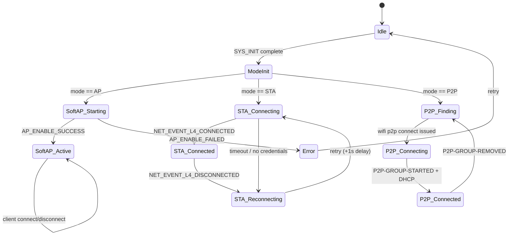
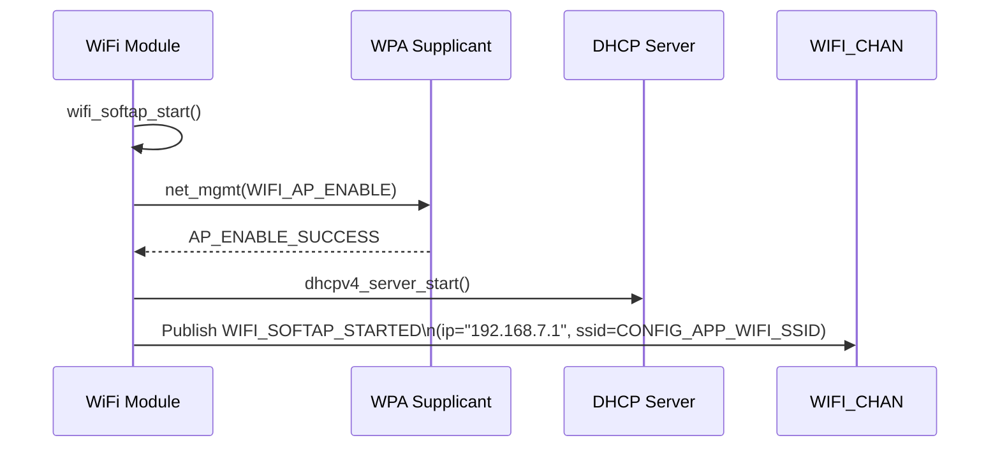
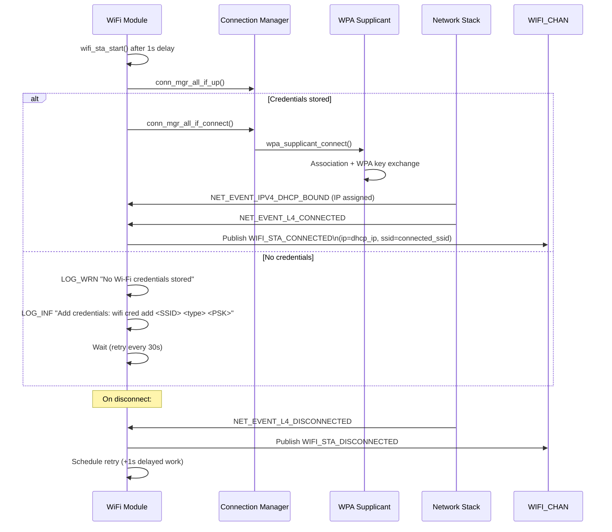
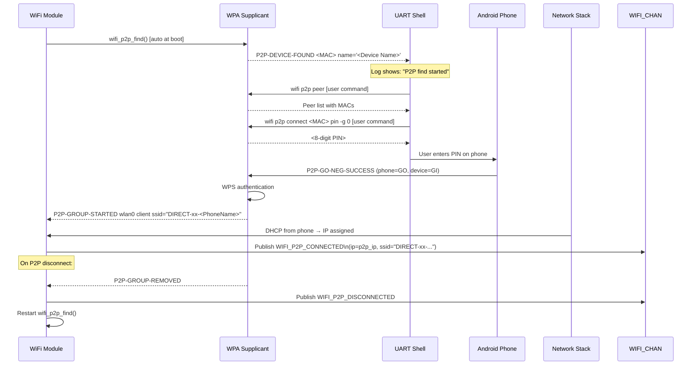

# WiFi Module Specification — v2.0

## Overview

The WiFi module manages all Wi-Fi connectivity for `nordic-wifi-webdash`. In v2.0 it is extended from a single-mode SoftAP manager to a **multi-mode Wi-Fi controller** supporting three runtime-selectable roles:

| Mode | Value | Description |
|------|-------|-------------|
| SoftAP | 0 | Device creates own AP; clients connect to it |
| STA | 1 | Device connects to existing infrastructure AP |
| P2P | 2 | Device connects to phone/peer via Wi-Fi Direct |

The active mode is determined at boot by reading `WIFI_MODE_CHAN` (published by mode_selector before WiFi init).

---

## Location

- **Path**: `src/modules/wifi/`
- **Files**: `wifi.c`, `wifi.h`, `Kconfig.wifi`, `CMakeLists.txt`

---

## Zbus Integration

**Subscribes to**: `WIFI_MODE_CHAN` — read once at `SYS_INIT` to select active path

**Publishes to**: `WIFI_CHAN`

```c
struct wifi_msg {
    enum wifi_msg_type type;     /* WIFI_SOFTAP_STARTED, WIFI_STA_CONNECTED,
                                    WIFI_STA_DISCONNECTED, WIFI_P2P_CONNECTED,
                                    WIFI_P2P_DISCONNECTED, WIFI_ERROR */
    enum wifi_mode     active_mode;
    char               ip_addr[16];  /* dotted-decimal, filled on connect */
    char               ssid[33];     /* filled on connect */
    int                error_code;
};
```

---

## State Machine

The WiFi module uses a unified SMF with mode-specific transitions:



---

## SoftAP Path

### Kconfig Requirements

```kconfig
CONFIG_WIFI=y
CONFIG_WIFI_NRF70=y
CONFIG_WIFI_NM_WPA_SUPPLICANT=y
CONFIG_WIFI_NM_WPA_SUPPLICANT_AP=y
CONFIG_NRF70_AP_MODE=y
CONFIG_NRF_WIFI_LOW_POWER=n

# Static IP + DHCP server
CONFIG_NET_CONFIG_SETTINGS=y
CONFIG_NET_CONFIG_MY_IPV4_ADDR="192.168.7.1"
CONFIG_NET_CONFIG_MY_IPV4_NETMASK="255.255.255.0"
CONFIG_NET_CONFIG_MY_IPV4_GW="192.168.7.1"
CONFIG_NET_DHCPV4_SERVER=y
CONFIG_NET_DHCPV4_SERVER_ADDR_COUNT=2
```

### Event Flow



### Published Event

`WIFI_SOFTAP_STARTED` with `ip_addr="192.168.7.1"` and `ssid=CONFIG_APP_WIFI_SSID`

---

## STA Path

### Kconfig Requirements

```kconfig
CONFIG_WIFI=y
CONFIG_WIFI_NRF70=y
CONFIG_WIFI_NM_WPA_SUPPLICANT=y
# SoftAP AP mode NOT required for STA-only build
# CONFIG_NRF70_AP_MODE is not needed

CONFIG_NET_CONNECTION_MANAGER=y
CONFIG_L2_WIFI_CONNECTIVITY=y
CONFIG_L2_WIFI_CONNECTIVITY_AUTO_CONNECT=y

CONFIG_WIFI_CREDENTIALS=y
CONFIG_FLASH=y
CONFIG_FLASH_MAP=y
CONFIG_FLASH_PAGE_LAYOUT=y
CONFIG_NVS=y
CONFIG_SETTINGS=y
CONFIG_SETTINGS_NVS=y

CONFIG_NET_DHCPV4=y
CONFIG_DNS_RESOLVER=y
```

### Credential Setup (one-time, via shell)

```
uart:~$ wifi cred add "MySSID" 3 "MyPassword"
uart:~$ wifi cred auto_connect
```

Or using `wifi_cred` with WPA2 (security type 3):
```
uart:~$ wifi cred add "HomeNetwork" WPA2-PSK "mypassword"
```

### Event Flow



### Reconnection Logic

- On `NET_EVENT_L4_DISCONNECTED`: publish `WIFI_STA_DISCONNECTED`, schedule delayed work (+1 s)
- Retry with `conn_mgr_all_if_connect()` — Connection Manager handles backoff

### Published Events

- `WIFI_STA_CONNECTED` — includes `ip_addr` (DHCP), `ssid` (connected AP name)
- `WIFI_STA_DISCONNECTED`

---

## P2P Path

### Kconfig Requirements

```kconfig
# Added via -DSNIPPET=wifi-p2p snippet (nrf/snippets/wifi-p2p/wifi-p2p.conf):
CONFIG_NRF70_P2P_MODE=y
CONFIG_NRF70_AP_MODE=y
CONFIG_WIFI_NM_WPA_SUPPLICANT_P2P=y
CONFIG_LTO=y
CONFIG_ISR_TABLES_LOCAL_DECLARATION=y

# Shell required for manual P2P peer management:
CONFIG_SHELL=y
CONFIG_NET_L2_WIFI_SHELL=y
```

### Build Command (nRF54LM20DK only)

```bash
west build -p -b nrf54lm20dk/nrf54lm20a/cpuapp -DSNIPPET=wifi-p2p -- -DSHIELD=nrf7002eb2
```

> P2P is NOT supported on nRF7002DK default build due to snippet requiring
> `ISR_TABLES_LOCAL_DECLARATION` which may conflict. nRF7002DK users can
> enable P2P via shell re-selection, but a P2P-specific build is needed.

### Connection Workflow (from WCS-106)



### WPA Supplicant Events Monitored

| Event string | Action |
|-------------|--------|
| `P2P-DEVICE-FOUND` | Log device name + MAC |
| `P2P-FIND-STOPPED` | Log "P2P scan complete" |
| `P2P-GO-NEG-SUCCESS` | Log role (client) + peer |
| `P2P-GROUP-STARTED ... client` | Start DHCP wait; publish `WIFI_P2P_CONNECTED` when IP arrives |
| `P2P-GROUP-REMOVED` | Publish `WIFI_P2P_DISCONNECTED`; restart find |

### Shell Helper Log at Boot (P2P mode)

```
[wifi] P2P mode active. Auto-starting peer discovery...
[wifi] P2P find started. Use shell commands:
[wifi]   wifi p2p peer           -- list discovered peers
[wifi]   wifi p2p connect <MAC> pin -g 0  -- connect to peer
[wifi] Open Wi-Fi Direct on your phone and wait for discovery.
```

---

## Error Handling

| Error | Behaviour |
|-------|-----------|
| SoftAP enable failed | Log error, publish `WIFI_ERROR`, retry after 5s |
| STA — no credentials | Log warning with instructions, wait 30s, retry |
| STA — association timeout | Connection Manager handles retry automatically |
| STA — DHCP timeout | Retry via Connection Manager |
| STA — L4 disconnect | Publish `WIFI_STA_DISCONNECTED`, reconnect in 1s |
| P2P — find stopped unexpectedly | Auto-restart `wifi_p2p_find()` |
| P2P — group removed | Publish `WIFI_P2P_DISCONNECTED`, restart find |

---

## Kconfig Module Options

```kconfig
# In Kconfig.wifi

config APP_WIFI_MODULE
    bool "Enable WiFi Module"
    default y

config APP_WIFI_SSID
    string "SoftAP SSID"
    default "WebDash_AP"
    depends on APP_WIFI_MODULE

config APP_WIFI_PASSWORD
    string "SoftAP Password (WPA2-PSK, min 8 chars)"
    default "12345678"
    depends on APP_WIFI_MODULE

config APP_WIFI_STA_RECONNECT_DELAY_MS
    int "STA reconnect delay in ms"
    default 1000
    depends on APP_WIFI_MODULE

config APP_WIFI_MODULE_LOG_LEVEL
    int "WiFi module log level"
    default 3   # LOG_LEVEL_INF
```

---

## Memory Footprint

| Component | Flash | RAM |
|-----------|-------|-----|
| SoftAP (WPA supplicant AP) | ~65 KB | ~50 KB |
| STA additions (wifi_credentials + conn_mgr) | +5 KB | +2 KB |
| P2P additions (-DSNIPPET=wifi-p2p) | +5 KB | +3 KB |
| WiFi module application code | ~3 KB | ~2 KB |

---

## Testing

### Build Test

```bash
# SoftAP / STA (nRF7002DK)
west build -p -b nrf7002dk/nrf5340/cpuapp

# SoftAP / STA (nRF54LM20DK)
west build -p -b nrf54lm20dk/nrf54lm20a/cpuapp -- -DSHIELD=nrf7002eb2

# P2P (nRF54LM20DK only)
west build -p -b nrf54lm20dk/nrf54lm20a/cpuapp -DSNIPPET=wifi-p2p -- -DSHIELD=nrf7002eb2
```

### SoftAP Verification

1. Flash and power on
2. Confirm SSID `WebDash_AP` visible
3. Connect phone, verify IP in `192.168.7.x` range
4. Navigate to `http://192.168.7.1`, verify dashboard loads

### STA Verification

1. Run `wifi cred add "TestAP" 3 "password"` via shell
2. Reboot
3. Confirm `[wifi] WiFi STA CONNECTED - IP: <ip>` log
4. Navigate to `http://<ip>` or `http://nrfwebdash.local`

### P2P Verification (WCS-106 procedure)

1. Flash P2P build to nRF54LM20DK
2. Select P2P mode at boot (hold BUTTON 0, type `3`)
3. Enable Wi-Fi Direct on Android phone
4. Run `wifi p2p peer` — confirm phone appears in list
5. Run `wifi p2p connect <phone_MAC> pin -g 0`
6. Enter displayed PIN on phone
7. Confirm `[wifi] P2P CONNECTED - IP: 192.168.49.x`
8. Navigate to `http://192.168.49.x`, verify dashboard loads

---

## Related Specs

- [architecture.md](architecture.md) — Zbus channels, SYS_INIT priorities
- [mode-selector.md](mode-selector.md) — how active mode is determined
- [webserver-module.md](webserver-module.md) — dashboard IP display per mode
