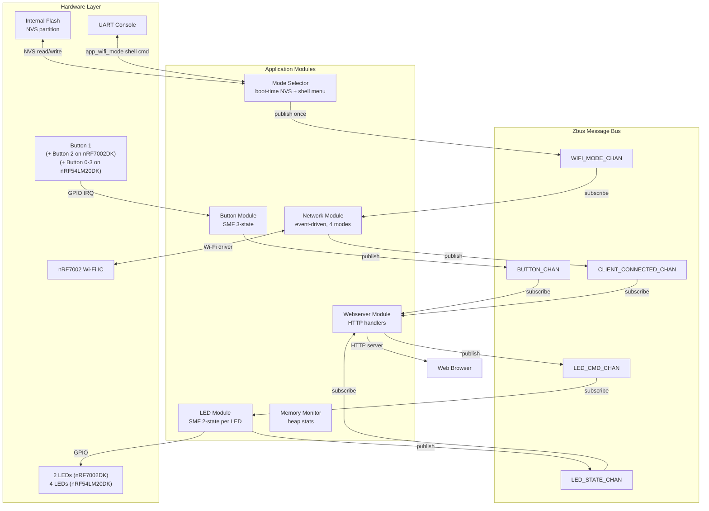
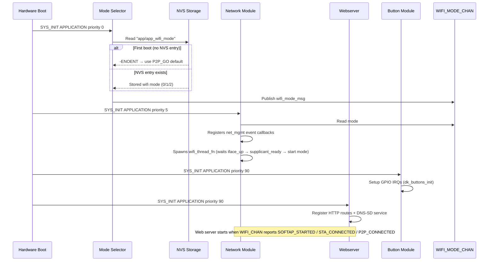

# System Architecture Specification — nordic-wifi-webdash

> **PRD Version**: 2026-04-09-12-00

## Changelog

| Version | Summary |
|---|---|
| 2026-04-14-10-00 | Code sync: enum app_wifi_mode (4 values, P2P_GO/P2P_CLIENT); WIFI_CHAN → CLIENT_CONNECTED_CHAN; wifi_msg → dk_wifi_info_msg; default mode → P2P_GO; duplicate mode_selector row in module map fixed |
| 2026-04-09-14-00 | Code alignment: fix module map (wifi/ → network/); SYS_INIT priorities (button/led/webserver=90, network=5); button_msg struct (remove duration_ms); boot sequence diagram |
| 2026-04-09-12-00 | Mode selector: remove Button-1 long-press; STA: session-based (no wifi_credentials); P2P: both boards; pbc connect method; updated memory budget |
| 2026-03-31 | v2.0 — multi-mode architecture, Mode Selector module, WIFI_MODE_CHAN |

---

## Overview

Nordic Wi-Fi WebDash uses an **SMF + Zbus modular architecture**. Each feature lives in its own module under `src/modules/`. All inter-module communication is exclusively through Zbus channels. Modules initialize through `SYS_INIT` at priority-ordered boot time.

v2.0 adds a **Mode Selector** module (NVS-backed, shell-command driven) and extends the **Wi-Fi module** to support three runtime-selectable Wi-Fi roles: SoftAP, STA, and P2P (Wi-Fi Direct).

---

## Module Map

```
src/
├── main.c                        ← startup banner, SYS_INIT trigger
└── modules/
    ├── messages.h                ← all Zbus message structs (shared)
    ├── mode_selector/            ← app_wifi_mode shell command + NVS persistence
    ├── button/                   ← GPIO button monitoring
    ├── led/                      ← LED output control
    ├── network/                  ← unified Wi-Fi + net-event module (SoftAP/STA/P2P_GO/P2P_CLIENT)
    ├── webserver/                ← HTTP server, REST API, web assets (index.html, main.js, styles.css)
    └── memory/                   ← heap monitor
```

---

## Zbus Channels

| Channel | Message Type | Publisher | Subscribers | Direction |
|---------|-------------|-----------|-------------|-----------|
| `WIFI_MODE_CHAN` | `struct wifi_mode_msg` | mode_selector | network | boot-time, once |
| `BUTTON_CHAN` | `struct button_msg` | button | webserver | runtime |
| `LED_CMD_CHAN` | `struct led_msg` | webserver | led | runtime |
| `LED_STATE_CHAN` | `struct led_state_msg` | led | webserver | runtime |
| `CLIENT_CONNECTED_CHAN` | `struct dk_wifi_info_msg` | network | webserver | runtime, on connectivity ready |

### Message Definitions (`src/modules/messages.h`)

```c
/* Wi-Fi operating mode */
enum app_wifi_mode {
    APP_WIFI_MODE_SOFTAP     = 0, /* Device creates own SoftAP */
    APP_WIFI_MODE_STA        = 1, /* Device connects to existing AP */
    APP_WIFI_MODE_P2P_GO     = 2, /* Wi-Fi Direct — device is Group Owner */
    APP_WIFI_MODE_P2P_CLIENT = 3, /* Wi-Fi Direct — device joins phone's group */
};

struct wifi_mode_msg {
    enum app_wifi_mode mode;
};

/* Button events */
enum button_msg_type {
    BUTTON_PRESSED,
    BUTTON_RELEASED,
};

struct button_msg {
    enum button_msg_type type;
    uint8_t  button_number;   /* 0-based DK index */
    uint32_t press_count;     /* total presses since boot */
    uint32_t timestamp;       /* k_uptime_get_32() */
};

/* LED commands */
enum led_msg_type {
    LED_COMMAND_ON,
    LED_COMMAND_OFF,
    LED_COMMAND_TOGGLE,
};

struct led_msg {
    enum led_msg_type type;
    uint8_t led_number;  /* 0-based DK index */
};

struct led_state_msg {
    uint8_t led_number;
    bool    is_on;
};

/* DK Wi-Fi connectivity info — published by network module when connection is ready */
struct dk_wifi_info_msg {
    enum app_wifi_mode active_mode; /* Mode that produced this event */
    char dk_ip_addr[16];            /* Device IP (dotted-decimal) */
    char dk_mac_addr[18];           /* Device MAC as XX:XX:XX:XX:XX:XX */
    char ssid[33];                  /* SoftAP/P2P_GO SSID, or connected AP/GO SSID */
    int  error_code;
};
```
    LED_COMMAND_OFF,
    LED_COMMAND_TOGGLE,
};

struct led_msg {
    enum led_msg_type type;
    uint8_t led_number;  /* 0-based DK index */
};

struct led_state_msg {
    uint8_t led_number;
    bool    is_on;
};

/* Wi-Fi connectivity status */
enum wifi_msg_type {
    WIFI_SOFTAP_STARTED,
    WIFI_STA_CONNECTED,
    WIFI_STA_DISCONNECTED,
    WIFI_P2P_CONNECTED,
    WIFI_P2P_DISCONNECTED,
    WIFI_ERROR,
};

struct wifi_msg {
    enum wifi_msg_type type;
    enum app_wifi_mode     active_mode;  /* NEW v2.0 */
    char               ip_addr[16];  /* NEW v2.0: dotted-decimal */
    char               ssid[33];     /* NEW v2.0 */
    int                error_code;
};
```

---

## SYS_INIT Priority Order

| Priority | Module | Function | Notes |
|----------|--------|----------|-------|
| 0 | mode_selector | `mode_selector_init` | Reads NVS mode; publishes WIFI_MODE_CHAN; registers `app_wifi_mode` shell command |
| 5 | network | `network_module_init` | Reads WIFI_MODE_CHAN; registers all net-mgmt event callbacks; starts Wi-Fi thread |
| 90 | button | `button_module_init` | GPIO IRQ setup via dk_buttons_and_leds |
| 90 | led | `led_module_init` | LED GPIO setup via dk_buttons_and_leds |
| 90 | webserver | `webserver_module_init` | HTTP service registration (server starts on CLIENT_CONNECTED_CHAN event) |
| default | memory | `app_heap_monitor_init` | Heap high-water logging (`CONFIG_KERNEL_INIT_PRIORITY_DEFAULT`) |

Mode selector **must** run before network (priority 0 < 5) because the network module reads the published mode at init time.

---

## System Architecture Diagram



---

## Boot Sequence



---

## Wi-Fi Mode Paths

### SoftAP Path (mode = 0)

- Kconfig: `CONFIG_NRF70_AP_MODE=y`, `CONFIG_WIFI_NM_WPA_SUPPLICANT_AP=y`
- Static IP: `192.168.7.1/24`
- DHCP server: leases `192.168.7.2–192.168.7.3` (max 2 clients)
- HTTP server: `http://192.168.7.1` or `http://nrfwebdash.local`
- Wi-Fi SSID: `CONFIG_APP_WIFI_SSID` (default `WebDash_AP`)

### STA Path (mode = 1)

- Kconfig: `CONFIG_WIFI_NM_WPA_SUPPLICANT=y`; conn_mgr auto-connect disabled
- Connection: session-based via `wifi connect -s <SSID> -p <pwd> -k 1` shell command
- IP: DHCP-assigned from AP
- HTTP server: `http://<dhcp-ip>` or `http://nrfwebdash.local`

### P2P Path (mode = 2, both boards)

- Kconfig: `CONFIG_NRF70_P2P_MODE=y`, `CONFIG_WIFI_NM_WPA_SUPPLICANT_P2P=y`
- Build: `-DSNIPPET=wifi-p2p` snippet required (both boards)
- Auto-start: `wifi p2p find` on boot
- Role: Group Interface (GI/client); phone acts as Group Owner (GO)
- IP: DHCP-assigned from phone's P2P group
- HTTP server: `http://<p2p-dhcp-ip>`
- Connection workflow (WCS-106):
  1. Device auto-starts `wifi p2p find`
  2. User runs `wifi p2p peer` to list discovered peers
  3. User runs `wifi p2p connect <MAC> pbc -g 0`
  4. User accepts on phone
  5. DHCP IP received from phone → `WIFI_P2P_CONNECTED` published

---

## Board Capability Matrix

| Capability | nRF7002DK | nRF54LM20DK + nRF7002EBII |
|------------|-----------|---------------------------|
| Total buttons | 2 | 3 (BUTTON 3 unavailable due to shield) |
| LEDs | 2 | 4 |
| SoftAP mode | Yes | Yes |
| STA mode | Yes | Yes |
| P2P mode | Yes (with -DSNIPPET=wifi-p2p) | Yes (with -DSNIPPET=wifi-p2p) |

---

## Memory Budget

### Baseline (v1.0 SoftAP only)

| Component | Flash | RAM |
|-----------|-------|-----|
| Wi-Fi Stack (SoftAP) | ~65 KB | ~50 KB |
| HTTP Server | ~25 KB | ~20 KB |
| SMF/Zbus | ~10 KB | ~5 KB |
| Application Modules | ~15 KB | ~10 KB |
| **Total** | **~115 KB** | **~85 KB** |

### v2.0 Additions

| New Feature | Flash | RAM | Notes |
|-------------|-------|-----|-------|
| Mode Selector + NVS | +8 KB | +3 KB | Settings + NVS + Flash storage |
| Wi-Fi STA path | +0 KB | +0 KB | Session-based; supplicant already linked; no wifi_credentials |
| P2P extensions | +5 KB | +3 KB | wpa_supplicant P2P (in -DSNIPPET=wifi-p2p build only) |
| Webserver `/api/system` | +1 KB | +0 KB | Small handler addition |
| **v2.0 Total Delta** | **+13 KB** | **+6 KB** | P2P build adds ~5 KB flash |

Estimated v2.0 total (SoftAP/STA build): ~128 KB Flash, ~91 KB RAM
Estimated v2.0 total (P2P build): ~133 KB Flash, ~94 KB RAM

Available budget (nRF5340 app core): 1 MB Flash, 448 KB RAM — margins are comfortable.

---

## Related Specs

- [network-module.md](network-module.md) — SoftAP/STA/P2P paths, event flows, Kconfig
- [led-module.md](led-module.md) — LED control, SMF 2-state, LED_CMD_CHAN / LED_STATE_CHAN
- [mode-selector.md](mode-selector.md) — boot window logic, NVS, shell menu
- [button-module.md](button-module.md) — GPIO button monitoring, board differences
- [webserver-module.md](webserver-module.md) — mode-aware HTTP server, `/api/system`
