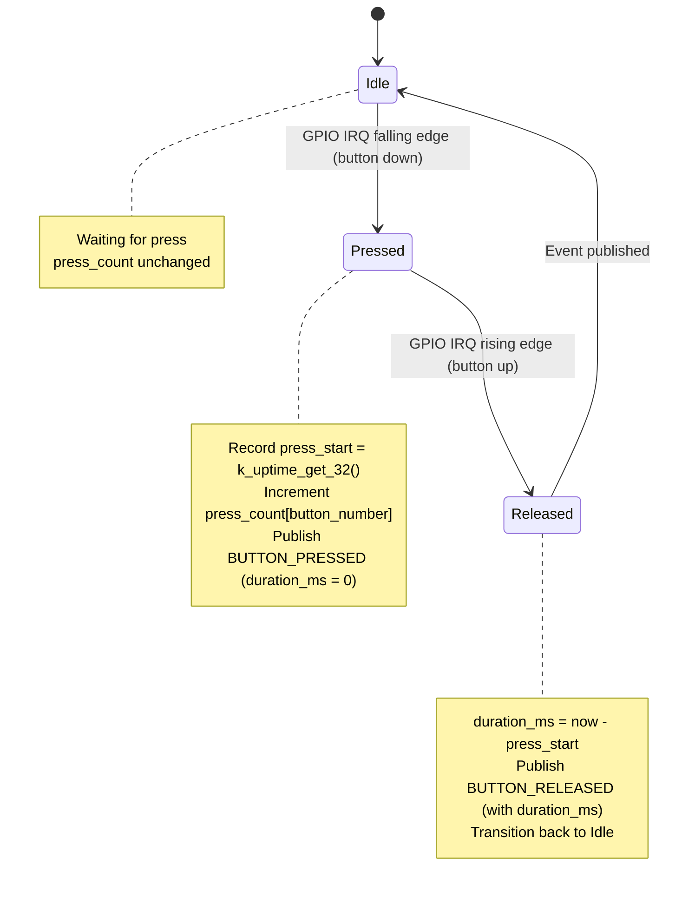

# Button Module Specification

> **PRD Version**: 2026-04-09-12-00

## Changelog

| Version | Summary |
|---|---|
| 2026-04-09-12-00 | Remove mode-selector boot-sampling interaction; remove `is_boot_long_press` field; simplify boot sequence (no GPIO conflict to manage) |
| 2026-03-31 | v2.0 — added `duration_ms`, `is_boot_long_press`, boot-window coordination |

---

## Overview

The Button module provides runtime GPIO button monitoring using the SMF (State Machine Framework). It detects press/release events, tracks press counts and durations, and publishes events via `BUTTON_CHAN`.

---

## Location

- **Path**: `src/modules/button/`
- **Files**: `button.c`, `button.h`, `Kconfig.button`, `CMakeLists.txt`

---

## Hardware

| Board | Available Buttons | DK Index | Silk Print |
|-------|------------------|----------|------------|
| nRF7002DK | 2 | 0, 1 | Button 1, Button 2 |
| nRF54LM20DK + nRF7002EBII | 3 | 0, 1, 2 | BUTTON 0, BUTTON 1, BUTTON 2 |

> Note: BUTTON 3 on nRF54LM20DK is unavailable when using nRF7002EBII shield (pin conflict with UART30).

---

## Zbus Integration

**Publishes**: `BUTTON_CHAN`

```c
struct button_msg {
    enum button_msg_type type;       /* BUTTON_PRESSED or BUTTON_RELEASED */
    uint8_t  button_number;          /* 0-based DK index */
    uint32_t duration_ms;            /* press duration (0 on PRESSED event) */
    uint32_t press_count;            /* total presses since boot, per button */
    uint32_t timestamp;              /* k_uptime_get_32() */
};
```

**Subscribers**: `webserver` module reads button state via polling the last message.

---

## State Machine



---

## Boot Sequence

The button module initializes at `SYS_INIT` priority **2**. Mode selector (priority 0) completes its NVS read and `WIFI_MODE_CHAN` publish before the button module registers any GPIO callbacks. There is no GPIO conflict.

---

## Debouncing

Software debounce using a 50 ms ignore window after the first edge:

```c
#define BUTTON_DEBOUNCE_MS  50
```

After a falling edge, any additional edges within 50 ms are ignored.

---

## Kconfig Options

```kconfig
config APP_BUTTON_MODULE
    bool "Enable Button Module"
    default y
    select DK_LIBRARY
    select GPIO

config APP_BUTTON_COUNT
    int "Number of buttons to monitor"
    default 2 if BOARD_NRF7002DK_NRF5340_CPUAPP
    default 3 if BOARD_NRF54LM20DK_NRF54LM20A_CPUAPP
    range 1 4
    depends on APP_BUTTON_MODULE
    help
      Set to match the number of available buttons on the target board.
      nRF7002DK has 2 buttons. nRF54LM20DK+nRF7002EBII has 3 usable buttons
      (BUTTON 3 conflicts with nRF7002EBII shield UART30).

config APP_BUTTON_DEBOUNCE_MS
    int "Button debounce time in ms"
    default 50
    depends on APP_BUTTON_MODULE

config APP_BUTTON_MODULE_LOG_LEVEL
    int "Button module log level"
    default 3   # LOG_LEVEL_INF
    depends on APP_BUTTON_MODULE
```

---

## Log Output Examples

```
[00:00:00.800] <inf> button: Button module initialized (2 buttons monitored)
[00:00:05.120] <inf> button: Button 1 (index 0) pressed
[00:00:05.420] <inf> button: Button 1 (index 0) released, duration=300ms, count=1
[00:00:06.100] <inf> button: Button 2 (index 1) pressed
[00:00:06.900] <inf> button: Button 2 (index 1) released, duration=800ms, count=1
```

---

## Memory Footprint

| Component | Flash | RAM |
|-----------|-------|-----|
| button.c (SMF + IRQ) | ~2 KB | ~1 KB |
| DK Library (shared) | ~3 KB | ~1 KB |

---

## Testing

### TC-BTN-001: Press and release detection

1. Flash firmware; open serial console
2. Press and release Button 1
3. Verify logs: `BUTTON_PRESSED` → `BUTTON_RELEASED` with `duration_ms > 0`
4. Verify `press_count` increments each press

### TC-BTN-002: Multiple buttons

1. Press all available buttons in sequence
2. Verify each button reports correct `button_number` (0-based)
3. Verify press counts are independent per button

### TC-BTN-003: Boot sequence

1. Boot the device normally
2. Verify button module logs `Button module initialized` after mode_selector logs `Booting in <mode> mode`
3. Verify subsequent presses are detected correctly

### TC-BTN-004: Board button count

1. nRF7002DK: verify only 2 buttons monitored; no IRQ registered for index 2+
2. nRF54LM20DK: verify 3 buttons monitored; BUTTON 3 (index 3) not registered

---

## Related Specs

- [architecture.md](architecture.md) — Zbus channels, SYS_INIT priority ordering
- [webserver-module.md](webserver-module.md) — reads button state for REST API
