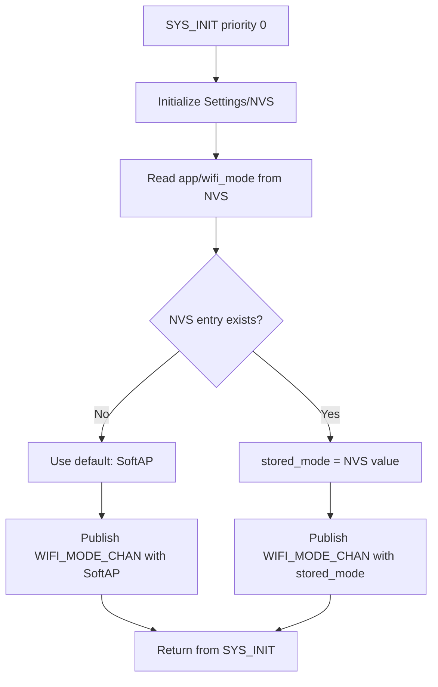
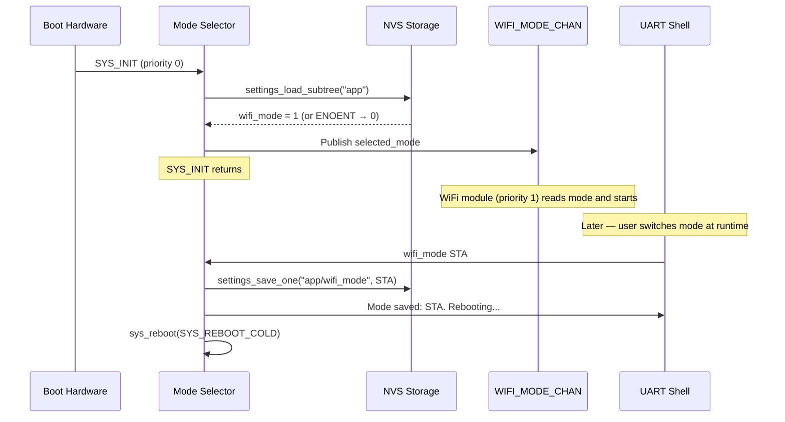

# Mode Selector Module Specification

> **PRD Version**: 2026-04-09-12-00

## Changelog

| Version | Summary |
|---|---|
| 2026-04-09-12-00 | Replace boot Button-1 long-press / shell menu with `wifi_mode` shell command; remove GPIO dependency; simplify boot flow to NVS read + publish only |
| 2026-03-31 | v2.0 — initial multi-mode NVS-backed mode selector |

---

## Overview

The Mode Selector module runs at the earliest `SYS_INIT` priority (0) and is responsible for:

1. Reading the persisted Wi-Fi mode from NVS on every boot
2. Publishing the resolved mode on `WIFI_MODE_CHAN` so the WiFi module (priority 1) can initialise the correct path
3. Registering a `wifi_mode [SoftAP|STA|P2P]` shell command that saves a new mode to NVS and triggers a reboot

This module guarantees that `WIFI_MODE_CHAN` is populated **before** the WiFi module's `SYS_INIT` runs. Mode changes take effect after the device reboots.

---

## Location

- **Path**: `src/modules/mode_selector/`
- **Files**: `mode_selector.c`, `mode_selector.h`, `Kconfig.mode_selector`, `CMakeLists.txt`

---

## Zbus Integration

**Publishes**: `WIFI_MODE_CHAN` once at boot

```c
struct wifi_mode_msg { enum wifi_mode mode; };
```

Published values:
- `WIFI_MODE_SOFTAP = 0` (factory default, first boot)
- `WIFI_MODE_STA    = 1`
- `WIFI_MODE_P2P    = 2` (only meaningful on P2P build)

---

## NVS Storage

| Key | Type | Default | Notes |
|-----|------|---------|-------|
| `app/wifi_mode` | `uint8_t` | `0` (AP) | Written only on user selection |

### NVS Partition

Uses Zephyr Settings subsystem over NVS backend:

```kconfig
CONFIG_SETTINGS=y
CONFIG_SETTINGS_NVS=y
CONFIG_NVS=y
CONFIG_FLASH=y
CONFIG_FLASH_MAP=y
CONFIG_FLASH_PAGE_LAYOUT=y
```

Settings key path: `"app/wifi_mode"` (written/read via `settings_save_one()` / `settings_load_subtree()`).

### Read/Write API

```c
/* Read stored mode (returns AP on first boot / ENOENT) */
static int mode_selector_nvs_read(enum wifi_mode *mode);

/* Write selected mode */
static int mode_selector_nvs_write(enum wifi_mode mode);
```

---

## Boot Flow



---

## wifi_mode Shell Command

The module registers a shell command that changes and persists the mode:

```
uart:~$ wifi_mode SoftAP
uart:~$ wifi_mode STA
uart:~$ wifi_mode P2P
```

**Behaviour**:
1. Validate argument (`SoftAP`, `STA`, `P2P` — case-insensitive).
2. Save new mode to NVS (`settings_save_one("app/wifi_mode", ...)`).
3. Log `[mode_selector] Mode saved: <mode>. Rebooting...`
4. Call `sys_reboot(SYS_REBOOT_COLD)` after a 200 ms delay (allows shell output to flush).

The new mode takes effect on the next boot.

**Invalid argument response**:
```
[mode_selector] Error: unknown mode 'foo'. Use: wifi_mode [SoftAP|STA|P2P]
```

After input `1`, `2`, or `3`:

```
 Mode set to: STA
 Saved to NVS. Booting in STA mode...
=============================================
```

On timeout (30 s with no valid input):

```
 Timeout. Keeping current mode: SoftAP
=============================================
```

---

## Sequence Diagram



---

## Kconfig Options

```kconfig
config APP_MODE_SELECTOR
    bool "Enable Wi-Fi mode selector"
    default y
    select SETTINGS
    select SETTINGS_NVS
    select NVS
    select FLASH
    select FLASH_MAP
    select SHELL
    help
      Reads persisted Wi-Fi mode from NVS at boot and publishes it on
      WIFI_MODE_CHAN. Registers the wifi_mode shell command to change
      and persist the mode at runtime.

config APP_MODE_SELECTOR_LOG_LEVEL
    int "Mode selector log level"
    default 3   # LOG_LEVEL_INF
    depends on APP_MODE_SELECTOR
```

---

## Memory Footprint

| Component | Flash | RAM |
|-----------|-------|-----|
| mode_selector.c | ~2 KB | ~0.5 KB |
| Settings/NVS subsystem | +6 KB | +2 KB |
| Flash storage support | +1 KB | +0.5 KB |
| **Total delta** | **~9 KB** | **~3 KB** |

---

## Log Output Examples

### Normal boot (SoftAP)

```
[00:00:00.100] <inf> mode_selector: Stored mode: SoftAP
[00:00:00.102] <inf> mode_selector: Booting in SoftAP mode.
```

### First boot (no NVS entry)

```
[00:00:00.100] <inf> mode_selector: No stored mode found. Using default: SoftAP
[00:00:00.102] <inf> mode_selector: Booting in SoftAP mode.
```

### Mode change via shell

```
uart:~$ wifi_mode STA
[mode_selector] Mode saved: STA. Rebooting...
*** Booting nRF Connect SDK ... ***
[00:00:00.100] <inf> mode_selector: Stored mode: STA
[00:00:00.102] <inf> mode_selector: Booting in STA mode.
```

---

## Dependencies

- `CONFIG_SETTINGS=y` + `CONFIG_NVS=y` — NVS persistence
- `CONFIG_ZBUS=y` — publishing `WIFI_MODE_CHAN`
- `CONFIG_SHELL=y` — `wifi_mode` shell command registration

---

## Testing

### TC-MS-001: Normal boot, SoftAP default

1. Flash fresh firmware (no NVS data)
2. Boot the device
3. Expected log: `No stored mode found. Using default: SoftAP` → `Booting in SoftAP mode`
4. Verify SoftAP SSID `WebDash_AP` visible

### TC-MS-002: Mode change to STA via shell

1. In serial console: `uart:~$ wifi_mode STA`
2. Expected log: `Mode saved: STA. Rebooting...`
3. After reboot: `Stored mode: STA`, `Booting in STA mode`

### TC-MS-003: Mode change to P2P via shell

1. In serial console: `uart:~$ wifi_mode P2P`
2. Expected log: `Mode saved: P2P. Rebooting...`
3. After reboot: `Stored mode: P2P`, `Booting in P2P mode`
4. Verify `wifi p2p find` starts automatically

### TC-MS-004: Invalid argument rejected

1. In serial console: `uart:~$ wifi_mode foo`
2. Expected: error message listing valid options; no reboot

### TC-MS-005: NVS persistence across power cycle

1. Run `wifi_mode STA` and wait for reboot
2. Power cycle device (no shell command)
3. Expected log on re-boot: `Stored mode: STA`; boots in STA mode

---

## Related Specs

- [architecture.md](architecture.md) — SYS_INIT priority ordering
- [button-module.md](button-module.md) — runtime button monitoring (separate from boot GPIO poll)
- [wifi-module.md](wifi-module.md) — reads WIFI_MODE_CHAN to select path
