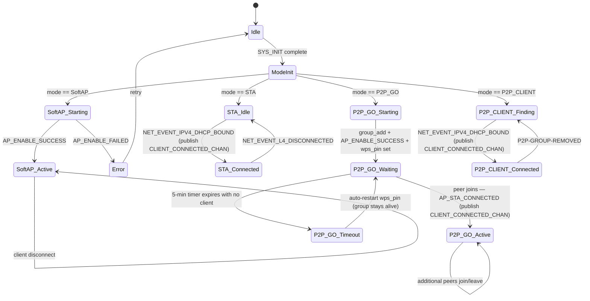
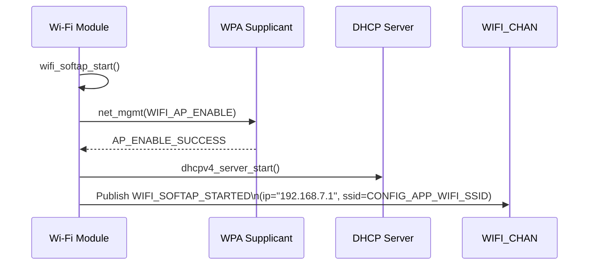
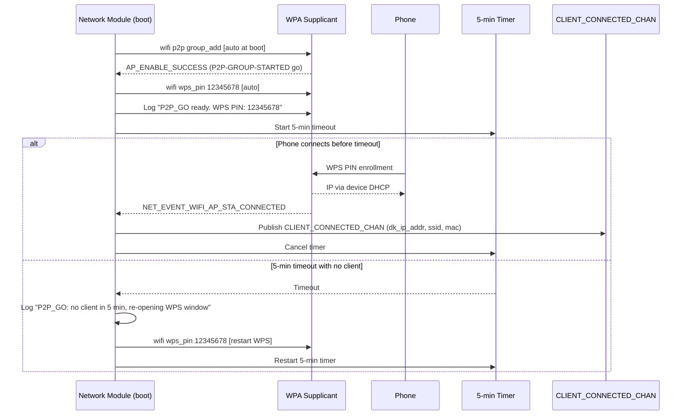
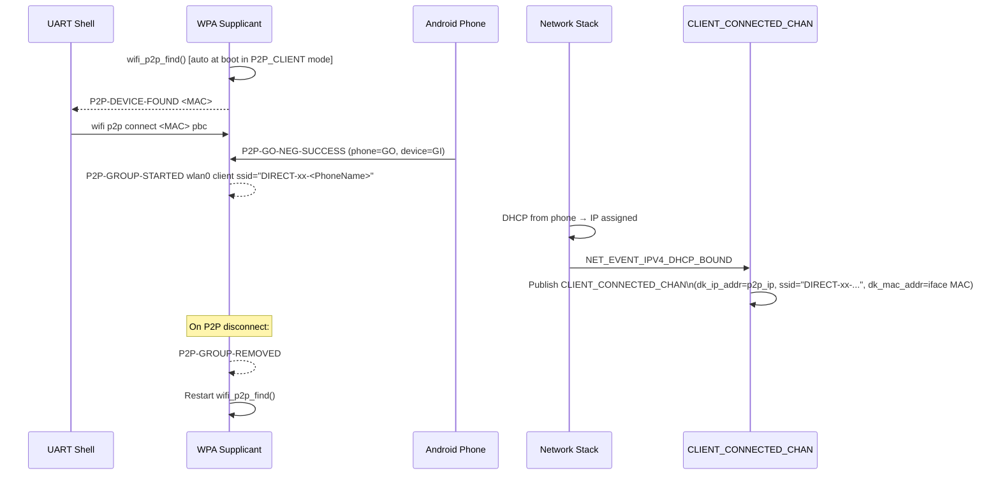

# Network Module Specification

> **PRD Version**: 2026-04-14-11-00

## Changelog

| Version | Summary |
|---|---|
| 2026-04-14-11-00 | P2P_GO auto-start: group_add + wps_pin called automatically at boot; 5-min wait timer for first client; state machine updated with P2P_GO_Waiting state; WPS PIN logged to console |
| 2026-04-14-10-00 | Code sync: P2P split into P2P_GO (device is GO) and P2P_CLIENT (device joins phone group); WIFI_CHAN+wifi_msg → CLIENT_CONNECTED_CHAN+dk_wifi_info_msg; WPS PIN Kconfig added; SoftAP/P2P_GO publish on AP_STA_CONNECTED; STA/P2P_CLIENT publish on DHCP_BOUND; DK MAC filled from net_if_get_link_addr |
| 2026-04-09-14-00 | Renamed from wifi-module.md to network-module.md to match src/modules/network/ directory |
| 2026-04-09-12-00 | STA: session-based connection (`wifi connect`) replaces stored credentials / conn_mgr auto-connect; P2P: now supported on both boards with `-DSNIPPET=wifi-p2p`; P2P connect method updated to `pbc` |
| 2026-03-31 | v2.0 — multi-mode SoftAP/STA/P2P controller |

---

## Overview

The Network module manages all Wi-Fi connectivity for `nordic-wifi-webdash`. It supports **four** runtime-selectable roles:

| Mode | Value | Description |
|------|-------|-------------|
| SoftAP | `APP_WIFI_MODE_SOFTAP` (0) | Device creates own AP; clients connect to it |
| STA | `APP_WIFI_MODE_STA` (1) | Device connects to existing infrastructure AP |
| P2P_GO | `APP_WIFI_MODE_P2P_GO` (2) | Wi-Fi Direct — device is the Group Owner (hosts the group) |
| P2P_CLIENT | `APP_WIFI_MODE_P2P_CLIENT` (3) | Wi-Fi Direct — device joins the phone's group |

The active mode is determined at boot by reading `WIFI_MODE_CHAN` (published by mode_selector before network init).

---

## Location

- **Path**: `src/modules/network/`
- **Files**: `net_event_mgmt.c`, `net_event_mgmt.h`, `wifi_utils.c`, `wifi_utils.h`, `CMakeLists.txt`

---

## Zbus Integration

**Subscribes to**: `WIFI_MODE_CHAN` — read once at `SYS_INIT` to select active path

**Publishes to**: `CLIENT_CONNECTED_CHAN` — when the DK's Wi-Fi connection is ready

```c
/* Published when connectivity is established in any mode */
struct dk_wifi_info_msg {
    enum app_wifi_mode active_mode; /* Mode that produced this event */
    char dk_ip_addr[16];            /* Device IP (dotted-decimal) */
    char dk_mac_addr[18];           /* Device MAC as XX:XX:XX:XX:XX:XX, from net_if_get_link_addr() */
    char ssid[33];                  /* AP SSID (SoftAP/P2P_GO = our SSID; STA/P2P_CLIENT = connected SSID) */
    int  error_code;
};
```

**Trigger events by mode:**

| Mode | Event that triggers publish |
|------|-----------------------------|
| SoftAP | `NET_EVENT_WIFI_AP_STA_CONNECTED` (first client joins) |
| P2P_GO | `NET_EVENT_WIFI_AP_STA_CONNECTED` (first peer joins) |
| STA | `NET_EVENT_IPV4_DHCP_BOUND` (IP assigned) |
| P2P_CLIENT | `NET_EVENT_IPV4_DHCP_BOUND` (IP assigned from phone's DHCP) |

---

## State Machine

The Wi-Fi module uses a unified SMF with mode-specific transitions:



---

## SoftAP Path

### Kconfig Requirements

```kconfig
CONFIG_WIFI=y
CONFIG_WIFI_NRF70=y
CONFIG_WIFI_NM_WPA_SUPPLICANT=y
CONFIG_WIFI_NM_WPA_SUPPLICANT_AP=y
CONFIG_WIFI_NM_WPA_SUPPLICANT_WPS=y
CONFIG_NRF70_AP_MODE=y
CONFIG_NRF_WIFI_LOW_POWER=n

# Static IP + DHCP server
CONFIG_NET_CONFIG_SETTINGS=y
CONFIG_NET_CONFIG_MY_IPV4_ADDR="192.168.7.1"
CONFIG_NET_CONFIG_MY_IPV4_NETMASK="255.255.255.0"
CONFIG_NET_CONFIG_MY_IPV4_GW="192.168.7.1"
CONFIG_NET_DHCPV4_SERVER=y
CONFIG_NET_DHCPV4_SERVER_ADDR_COUNT=2
```

### Event Flow



### Published Event

`CLIENT_CONNECTED_CHAN` with `dk_ip_addr="192.168.7.1"`, `dk_mac_addr` from iface, `ssid=CONFIG_APP_WIFI_SSID`. Triggered on `NET_EVENT_WIFI_AP_STA_CONNECTED` (first station joins).

---

## STA Path

### Kconfig Requirements

```kconfig
CONFIG_WIFI=y
CONFIG_WIFI_NRF70=y
CONFIG_WIFI_NM_WPA_SUPPLICANT=y

# conn_mgr auto-connect is DISABLED; connections are started manually
# via the wifi shell command
CONFIG_NET_CONNECTION_MANAGER_AUTO_IF_DOWN=n

CONFIG_NET_DHCPV4=y
CONFIG_DNS_RESOLVER=y
```

### Connection (session-based, via shell)

STA connections are started manually each session. No credentials are stored in NVS:

```
uart:~$ wifi connect -s <SSID> -p <password> -k 1
```

The `-k 1` flag selects WPA2-PSK security. After a disconnect the device returns to STA idle state; the user must re-issue `wifi connect` for the next session.

### Event Flow

```mermaid
sequenceDiagram
    participant Wi-Fi as Wi-Fi Module
    participant WPA as WPA Supplicant
    participant Net as Network Stack
    participant WIFI_CHAN

    Wi-Fi->>Wi-Fi: wifi_sta_start() — wait for supplicant ready
    Note over Wi-Fi: Idle; waiting for manual wifi connect command

    WPA->>WPA: User runs: wifi connect -s SSID -p pwd -k 1
    WPA->>WPA: Association + WPA key exchange
    Net->>Wi-Fi: NET_EVENT_IPV4_DHCP_BOUND (IP assigned)
    Net->>Wi-Fi: NET_EVENT_L4_CONNECTED
    Wi-Fi->>WIFI_CHAN: Publish WIFI_STA_CONNECTED (ip=dhcp_ip, ssid=connected_ssid)

    Note over Wi-Fi: On disconnect:
    Net->>Wi-Fi: NET_EVENT_L4_DISCONNECTED
    Wi-Fi->>WIFI_CHAN: Publish WIFI_STA_DISCONNECTED
    Wi-Fi->>Wi-Fi: Return to idle (no auto-retry)
```

### Published Events

- `CLIENT_CONNECTED_CHAN` on `NET_EVENT_IPV4_DHCP_BOUND` — includes `dk_ip_addr` (DHCP), `dk_mac_addr` from iface, `ssid` (connected AP)
- On disconnect: no further publish; webserver continues serving with cached state

---

## P2P_GO Path (device is Group Owner)

### Kconfig Requirements

```kconfig
# Added via -DSNIPPET=wifi-p2p snippet:
CONFIG_NRF70_P2P_MODE=y
CONFIG_NRF70_AP_MODE=y
CONFIG_WIFI_NM_WPA_SUPPLICANT_P2P=y
CONFIG_WIFI_NM_WPA_SUPPLICANT_WPS=y
CONFIG_LTO=y
CONFIG_ISR_TABLES_LOCAL_DECLARATION=y

CONFIG_SHELL=y
CONFIG_NET_L2_WIFI_SHELL=y
```

### Build Command

```bash
# Both boards — add -DSNIPPET=wifi-p2p to any build
west build -p -b nrf7002dk/nrf5340/cpuapp -DSNIPPET=wifi-p2p
west build -p -b nrf54lm20dk/nrf54lm20a/cpuapp -DSNIPPET=wifi-p2p -- -DSHIELD=nrf7002eb2
```

### Connection Workflow

In P2P_GO mode the firmware **automatically** performs all setup steps at boot — no manual shell commands are needed.

**Boot sequence:**
1. `wifi p2p group_add` — creates the P2P group (device becomes GO)
2. `wifi wps_pin 12345678` — activates WPS PIN enrollment (PIN logged to serial console)
3. Wait up to **5 minutes** for a phone to connect via WPS PIN
4. On `NET_EVENT_WIFI_AP_STA_CONNECTED` → publish `CLIENT_CONNECTED_CHAN`; HTTP server starts
5. If no client joins within 5 minutes: log timeout, restart `wifi wps_pin` (group stays alive; WPS window re-opens)



**Serial console output at P2P_GO boot:**
```
[net_event_mgmt] P2P_GO mode: creating group...
[net_event_mgmt] P2P group started. GO IP: 192.168.49.1
[net_event_mgmt] WPS PIN active: 12345678
[net_event_mgmt] On your phone: Wi-Fi Direct → connect to DIRECT-xx-WebDash → PIN 12345678
[net_event_mgmt] Waiting for client (timeout: 5 min)...
```

### Published Event

`CLIENT_CONNECTED_CHAN` on `NET_EVENT_WIFI_AP_STA_CONNECTED` (first peer joins the group).

---

## P2P_CLIENT Path (device joins phone’s group)

### Connection Workflow

User starts `wifi p2p find`, waits for a peer to appear, then connects. Phone acts as GO and assigns IPs.



### WPA Supplicant Events Monitored

| Event string | Action |
|-------------|--------|
| `P2P-DEVICE-FOUND` | Log device name + MAC |
| `P2P-FIND-STOPPED` | Log "P2P scan complete" |
| `P2P-GO-NEG-SUCCESS` | Log role (client) + peer |
| `P2P-GROUP-STARTED ... client` | Wait for DHCP; publish `CLIENT_CONNECTED_CHAN` on DHCP_BOUND |
| `P2P-GROUP-REMOVED` | Restart `wifi_p2p_find()` |

---

## Error Handling

| Error | Behaviour |
|-------|-----------|
| SoftAP enable failed | Log error, retry after 5 s |
| STA — no active connect | Log info `"Run: wifi connect -s <SSID> -p <pwd> -k 1"`, wait in idle |
| STA — DHCP timeout | Connection Manager handles retry |
| STA — L4 disconnect | Return to idle (no auto-retry); webserver keeps cached state |
| P2P_GO — group creation failed | Log error, advise re-running `wifi p2p group_add` |
| P2P_CLIENT — find stopped unexpectedly | Auto-restart `wifi_p2p_find()` |
| P2P_CLIENT — group removed | Restart `wifi_p2p_find()` |

---

## Kconfig Module Options

```kconfig
# In Kconfig.wifi

config APP_WIFI_MODULE
    bool "Enable Wi-Fi Module"
    default y

config APP_WIFI_SSID
    string "SoftAP SSID"
    default "WebDash_AP"
    depends on APP_WIFI_MODULE

config APP_WIFI_PASSWORD
    string "SoftAP Password (WPA2-PSK, min 8 chars)"
    default "12345678"
    depends on APP_WIFI_MODULE

config APP_WIFI_STA_RECONNECT_DELAY_MS
    int "STA reconnect delay in ms"
    default 1000
    depends on APP_WIFI_MODULE

config APP_WIFI_MODULE_LOG_LEVEL
    int "Wi-Fi module log level"
    default 3   # LOG_LEVEL_INF
```

---

## Memory Footprint

| Component | Flash | RAM |
|-----------|-------|-----|
| SoftAP (WPA supplicant AP) | ~65 KB | ~50 KB |
| STA additions (session-based, no wifi_credentials) | +0 KB | +0 KB |
| P2P additions (-DSNIPPET=wifi-p2p) | +5 KB | +3 KB |
| Wi-Fi module application code | ~3 KB | ~2 KB |

---

## Testing

### Build Test

```bash
# SoftAP / STA (nRF7002DK)
west build -p -b nrf7002dk/nrf5340/cpuapp

# SoftAP / STA (nRF54LM20DK)
west build -p -b nrf54lm20dk/nrf54lm20a/cpuapp -- -DSHIELD=nrf7002eb2

# P2P (both boards)
west build -p -b nrf7002dk/nrf5340/cpuapp -DSNIPPET=wifi-p2p
west build -p -b nrf54lm20dk/nrf54lm20a/cpuapp -DSNIPPET=wifi-p2p -- -DSHIELD=nrf7002eb2
```

### SoftAP Verification

1. Flash and power on
2. Confirm SSID `WebDash_AP` visible
3. Connect phone, verify IP in `192.168.7.x` range
4. Navigate to `http://192.168.7.1`, verify dashboard loads

### STA Verification

1. Boot in STA mode (`app_wifi_mode STA` then reboot)
2. Run `wifi connect -s "TestAP" -p "password" -k 1` via shell
3. Confirm `[network] STA CONNECTED - IP: <ip>` log
4. Navigate to `http://<ip>` or `http://nrfwebdash.local`

### P2P Verification (WCS-106 procedure)

1. Flash P2P build to either board
2. Run `app_wifi_mode P2P` then reboot
3. Enable Wi-Fi Direct on Android phone
4. Run `wifi p2p peer` — confirm phone appears in list
5. Run `wifi p2p connect <phone_MAC> pbc -g 0`
6. Accept connection on phone
7. Confirm `[network] P2P CONNECTED - IP: 192.168.49.x`
8. Navigate to `http://192.168.49.x`, verify dashboard loads

---

## Related Specs

- [architecture.md](architecture.md) — Zbus channels, SYS_INIT priorities
- [mode-selector.md](mode-selector.md) — how active mode is determined
- [webserver-module.md](webserver-module.md) — dashboard IP display per mode
