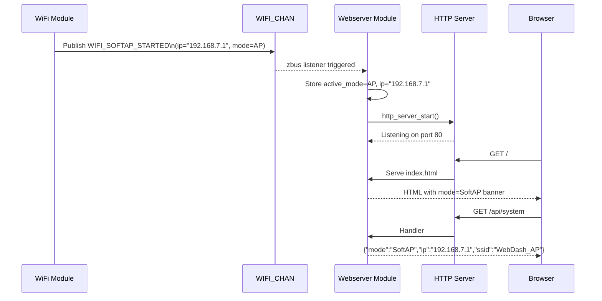

# Webserver Module Specification

> **PRD Version**: 2026-04-09-12-00

## Changelog

| Version | Summary |
|---|---|
| 2026-04-09-14-00 | Code alignment: fix DNS-SD macro to `DNS_SD_REGISTER_SERVICE` (not `DNS_SD_REGISTER_TCP_SERVICE`) |
| 2026-04-09-12-00 | Add DNS-SD `_http._tcp.local` service registration (FR-104) |
| 2026-03-31 | v2.0 — mode-aware dashboard, `/api/system` endpoint |

---

## Overview

The Webserver module serves the WebDash over HTTP and exposes a JSON REST API for device state control. It is **mode-aware**: it shows the active Wi-Fi mode in the UI banner and provides a `/api/system` endpoint that returns mode, IP address, and SSID.

The module subscribes to `WIFI_CHAN` to know when the network is ready and what IP/mode is active, `BUTTON_CHAN` for button state polling, and `LED_STATE_CHAN` for LED state.

---

## Location

- **Path**: `src/modules/webserver/`
- **Files**: `webserver.c`, `webserver.h`, `Kconfig.webserver`, `CMakeLists.txt`

---

## Zbus Integration

**Subscribes to**:
- `WIFI_CHAN` — to know when to start the HTTP server and what mode/IP is active
- `BUTTON_CHAN` — caches latest button states for `/api/buttons`
- `LED_STATE_CHAN` — caches latest LED states for `/api/leds`

**Publishes to**:
- `LED_CMD_CHAN` — when `POST /api/led` is received

---

## HTTP Server Startup

The HTTP server starts after receiving `WIFI_SOFTAP_STARTED`, `WIFI_STA_CONNECTED`, or `WIFI_P2P_CONNECTED` on `WIFI_CHAN`.

| Mode | Server starts on | Access URL |
|------|-----------------|------------|
| SoftAP | `WIFI_SOFTAP_STARTED` | `http://192.168.7.1` or `http://nrfwebdash.local` |
| STA | `WIFI_STA_CONNECTED` | `http://<dhcp-ip>` or `http://nrfwebdash.local` |
| P2P | `WIFI_P2P_CONNECTED` | `http://<p2p-dhcp-ip>` (mDNS may not work on all phones) |

---

## DNS-SD Service Registration

On HTTP server start the module registers an `_http._tcp.local` DNS-SD service record so that zero-conf browsers and discovery tools (e.g. Bonjour, Avahi, iOS/Android service browsers) find the device automatically without knowing its IP.

```c
#include <zephyr/net/dns_sd.h>

static const uint16_t http_dns_sd_port = sys_cpu_to_be16(CONFIG_APP_HTTP_PORT);

DNS_SD_REGISTER_SERVICE(webdash_http, CONFIG_NET_HOSTNAME,
                         "_http", "_tcp", "local",
                         DNS_SD_EMPTY_TXT, &http_dns_sd_port);
```

This works in conjunction with `CONFIG_MDNS_RESPONDER=y` so the device is reachable both by:  
- Hostname: `http://nrfwebdash.local` (mDNS A record)  
- Service: `_http._tcp.local` (DNS-SD PTR/SRV/TXT records)

---

## REST API Endpoints

### GET /api/system 

Returns current Wi-Fi mode, IP address, and SSID.

**Response**:
```json
{
  "mode": "SoftAP",
  "ip": "192.168.7.1",
  "ssid": "WebDash_AP",
  "uptime_s": 42
}
```

`mode` values: `"SoftAP"`, `"STA"`, `"P2P"`

---

### GET /api/buttons

Returns current state of all buttons.

**Response**:
```json
{
  "buttons": [
    {"number": 0, "name": "Button 1", "pressed": false, "count": 5},
    {"number": 1, "name": "Button 2", "pressed": true,  "count": 12}
  ]
}
```

Board-adaptive: nRF7002DK returns 2 entries; nRF54LM20DK returns 3 entries.

---

### GET /api/leds

Returns current state of all LEDs.

**Response**:
```json
{
  "leds": [
    {"number": 0, "name": "LED1", "is_on": true},
    {"number": 1, "name": "LED2", "is_on": false}
  ]
}
```

Board-adaptive: nRF7002DK returns 2 entries; nRF54LM20DK returns 4 entries.

---

### POST /api/led

Controls a specific LED.

**Request**:
```json
{"led": 0, "action": "on"}
```

**Actions**: `"on"`, `"off"`, `"toggle"`

**Response**: `200 OK` on success; `400 Bad Request` on invalid parameters.

---

## Web UI Updates 

### Mode Banner

A new header banner shows the active Wi-Fi mode with color coding:

| Mode | Badge color | Label |
|------|-------------|-------|
| SoftAP | Blue | `AP Mode — 192.168.7.1` |
| STA | Green | `Station Mode — <IP>` |
| P2P | Purple | `P2P Direct — <IP>` |

### Existing Panels (unchanged)

- Button Status Panel: press state, count, animation
- LED Control Panel: ON/OFF/Toggle per LED
- System Information: SSID, IP, refresh rate

### Auto-Refresh

The web UI polls `/api/system`, `/api/buttons`, and `/api/leds` every 500 ms (unchanged from v1.0).

---

## Sequence Diagram — Mode-Aware Startup



---

## Kconfig Options

```kconfig
config APP_WEBSERVER_MODULE
    bool "Enable Webserver Module"
    default y
    select HTTP_SERVER
    select HTTP_PARSER
    select JSON_LIBRARY

config APP_HTTP_PORT
    int "HTTP server port"
    default 80
    depends on APP_WEBSERVER_MODULE

config APP_WEBSERVER_MODULE_LOG_LEVEL
    int "Webserver module log level"
    default 3   # LOG_LEVEL_INF
    depends on APP_WEBSERVER_MODULE
```

---

## Memory Footprint

| Component | Flash | RAM |
|-----------|-------|-----|
| webserver.c (handlers) | ~8 KB | ~5 KB |
| HTTP server (Zephyr) | ~25 KB | ~20 KB |
| JSON library | ~5 KB | ~2 KB |
| www/ static files (index.html, main.js, styles.css) | ~10 KB Flash | 0 (served from flash) |
| **Total** | **~48 KB** | **~27 KB** |

---

## Log Output Examples

```
[00:00:06.001] <inf> webserver: WIFI_SOFTAP_STARTED received — mode=SoftAP ip=192.168.7.1
[00:00:06.005] <inf> webserver: HTTP server started on port 80
[00:00:10.123] <inf> webserver: GET /api/system
[00:00:10.125] <inf> webserver: POST /api/led {"led":0,"action":"toggle"}
[00:00:10.127] <inf> webserver: LED 0 toggled
```

---

## Testing

### TC-WEB-001: Dashboard loads in SoftAP mode

1. Boot in SoftAP mode
2. Connect phone to `WebDash_AP`
3. Navigate to `http://192.168.7.1`
4. Verify mode banner shows `AP Mode — 192.168.7.1`

### TC-WEB-002: Dashboard loads in STA mode

1. Run `wifi_mode STA` and reboot
2. Run `wifi connect -s "TestAP" -p "password" -k 1` via shell
3. Note DHCP IP from logs
4. Navigate to `http://<dhcp-ip>` or `http://nrfwebdash.local`
5. Verify mode banner shows `Station Mode — <IP>`

### TC-WEB-003: Dashboard loads in P2P mode

1. Boot in P2P mode; complete P2P connection via shell
2. Note P2P IP from logs (e.g., `192.168.49.x`)
3. Navigate to `http://192.168.49.x` from phone browser
4. Verify mode banner shows `P2P Direct — 192.168.49.x`

### TC-WEB-004: GET /api/system

```bash
curl http://192.168.7.1/api/system
# Expected: {"mode":"SoftAP","ip":"192.168.7.1","ssid":"WebDash_AP","uptime_s":15}
```

### TC-WEB-005: LED and button API (regression)

1. GET `/api/buttons` — verify count of entries matches board
2. GET `/api/leds` — verify count of entries matches board
3. POST `/api/led` with `{"led":0,"action":"toggle"}` — verify LED changes

---

## Related Specs

- [architecture.md](architecture.md) — Zbus channels overview
- [network-module.md](network-module.md) — WIFI_CHAN events that trigger server start
- [button-module.md](button-module.md) — BUTTON_CHAN events cached by webserver
