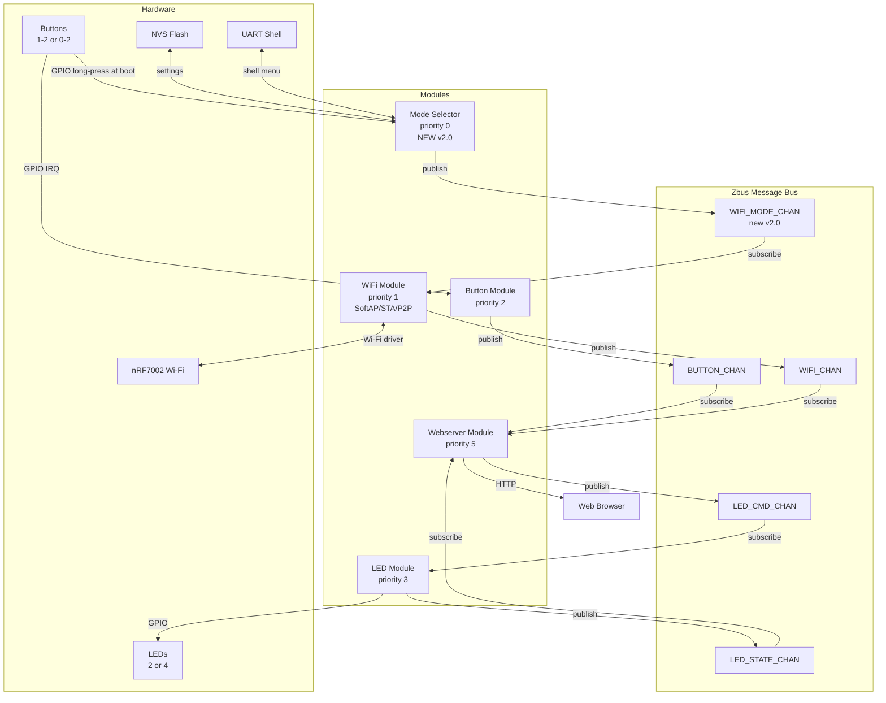

# Product Requirements Document (PRD) — Nordic WiFi Web Dashboard

## Document Information

- **Product Name**: Nordic WiFi Web Dashboard
- **Product ID**: nordic-wifi-webdash
- **Document Version**: 2.0.0
- **Date Created**: February 2, 2026
- **Last Updated**: March 31, 2026
- **Product Manager**: Charlie Shao
- **Status**: Draft — Pending Review
- **Target Release**: v2.0.0
- **Architecture**: SMF + Zbus modular
- **NCS Version**: v3.2.4

---

## 1. Executive Summary

### 1.1 Product Overview

Nordic WiFi Web Dashboard (`nordic-wifi-webdash`) is a professional IoT demonstration and reference platform for **nRF70 series Wi-Fi development kits**. It provides real-time device state control (buttons, LEDs) through a browser-based dashboard served directly from the nRF device — no cloud infrastructure required.

v2.0 upgrades the platform from a single SoftAP mode to a **three-mode Wi-Fi platform**: SoftAP (creates own AP), STA (connects to existing network), and P2P/Wi-Fi Direct (connects to phone). The active mode is selected at boot via a shell menu triggered by holding Button 1 for 3 seconds, and is persisted in NVS so it survives reboots.

### 1.2 Problem Statement

v1.0 locked the device into SoftAP mode, which requires users to disconnect from their existing network. Developers and demo users need:
- **STA mode**: access the dashboard while staying connected to their home/office network
- **P2P mode**: direct phone-to-device connection with no AP infrastructure at all
- **Persistent mode selection**: the device should remember its role across power cycles

### 1.3 Target Users

- **Primary**: Embedded developers evaluating nRF70 Wi-Fi capabilities (STA, SoftAP, P2P)
- **Secondary**: Nordic field application engineers running customer demos
- **Tertiary**: IoT hobbyists learning modular Zephyr/NCS architecture

### 1.4 Success Metrics

| Metric | Target | Measurement |
|--------|--------|-------------|
| Build success | Clean build for all boards and modes | CI pipeline |
| SoftAP dashboard load time | < 2 s | Manual test |
| STA connection time | < 30 s from boot | Manual / UART log |
| P2P connection time | < 120 s from boot (user-assisted) | Manual test |
| Mode persistence | Selected mode survives power cycle | TC-MS-005 |
| Time to first working demo | < 15 min from flash | User feedback |
| Memory headroom | > 100 KB Flash, > 50 KB RAM free | Build report |

---

## 2. Product Requirements

### 2.1 Feature Selection

#### Core Wi-Fi Features

| Feature | Selected | Config Option | Flash | RAM |
|---------|----------|---------------|-------|-----|
| Wi-Fi Shell | ☑ | `CONFIG_NET_L2_WIFI_SHELL=y` | ~5 KB | ~2 KB |
| Wi-Fi STA | ☑ | `CONFIG_WIFI_NM_WPA_SUPPLICANT=y` | ~60 KB | ~40 KB |
| Wi-Fi SoftAP | ☑ | `CONFIG_NRF70_AP_MODE=y` | ~65 KB | ~50 KB |
| Wi-Fi P2P | ☑ | `CONFIG_WIFI_NM_WPA_SUPPLICANT_P2P=y` (snippet) | ~70 KB | ~45 KB |
| Wi-Fi Credentials | ☑ | `CONFIG_WIFI_CREDENTIALS=y` | ~5 KB | ~2 KB |

#### Network Protocol Features

| Feature | Selected | Config Option | Flash | RAM |
|---------|----------|---------------|-------|-----|
| IPv4 | ☑ | `CONFIG_NET_IPV4=y` | ~15 KB | ~5 KB |
| TCP | ☑ | `CONFIG_NET_TCP=y` | ~20 KB | ~10 KB |
| UDP | ☑ | `CONFIG_NET_UDP=y` | ~5 KB | ~2 KB |
| HTTP Server | ☑ | `CONFIG_HTTP_SERVER=y` | ~25 KB | ~20 KB |
| DHCP Client | ☑ | `CONFIG_NET_DHCPV4=y` | ~8 KB | ~4 KB |
| DHCP Server | ☑ (SoftAP) | `CONFIG_NET_DHCPV4_SERVER=y` | ~12 KB | ~8 KB |
| mDNS | ☑ | `CONFIG_MDNS_RESPONDER=y` | ~10 KB | ~5 KB |
| DNS Resolver | ☑ | `CONFIG_DNS_RESOLVER=y` | ~6 KB | ~3 KB |

#### Storage Features

| Feature | Selected | Config Option | Flash | RAM |
|---------|----------|---------------|-------|-----|
| Flash | ☑ | `CONFIG_FLASH=y` | ~5 KB | ~2 KB |
| NVS | ☑ | `CONFIG_NVS=y` | ~8 KB | ~3 KB |
| Settings | ☑ | `CONFIG_SETTINGS=y` | ~10 KB | ~4 KB |

#### Development & Debugging

| Feature | Selected | Config Option | Flash | RAM |
|---------|----------|---------------|-------|-----|
| Shell | ☑ | `CONFIG_SHELL=y` | ~15 KB | ~8 KB |
| Logging | ☑ | `CONFIG_LOG=y` | ~10 KB | ~5 KB |
| Stack Sentinel | ☑ | `CONFIG_STACK_SENTINEL=y` | ~1 KB | — |

#### State Management & Architecture

| Feature | Selected | Config Option | Flash | RAM |
|---------|----------|---------------|-------|-----|
| SMF | ☑ | `CONFIG_SMF=y` | ~4 KB | ~2 KB |
| Zbus | ☑ | `CONFIG_ZBUS=y` | ~6 KB | ~3 KB |

#### Peripheral & Sensors

| Feature | Selected | Config Option | Flash | RAM |
|---------|----------|---------------|-------|-----|
| GPIO | ☑ | `CONFIG_GPIO=y` | ~3 KB | ~1 KB |
| DK Library | ☑ | `CONFIG_DK_LIBRARY=y` | ~3 KB | ~1 KB |

---

### 2.2 Functional Requirements

#### P0 — Must Have

| ID | User Story | Acceptance Criteria | Spec Reference |
|----|-----------|---------------------|----------------|
| FR-001 | As a user, I want to connect my device in SoftAP mode and access the dashboard | - SSID `WebDashboard_AP` visible<br>- Dashboard accessible at `http://192.168.7.1`<br>- Max 2 clients enforced | [wifi-module.md](openspec/specs/wifi-module.md) — SoftAP path |
| FR-002 | As a user, I want to connect my device in STA mode to my existing network | - Device connects with stored `wifi_cred` credentials<br>- Dashboard accessible at DHCP IP or `http://nrfwifi.local`<br>- `[wifi] STA CONNECTED IP: <x>` logged | [wifi-module.md](openspec/specs/wifi-module.md) — STA path |
| FR-003 | As a user, I want to connect my phone directly to the device using Wi-Fi Direct (P2P) | - Device auto-starts P2P find at boot in P2P mode<br>- `wifi p2p peer` shows phone in list<br>- `wifi p2p connect <MAC> pin -g 0` connects<br>- Dashboard accessible at P2P IP<br>- nRF54LM20DK only | [wifi-module.md](openspec/specs/wifi-module.md) — P2P path |
| FR-004 | As a user, I want to select which Wi-Fi mode the device uses by holding Button 1 at boot | - Hold Button 1 >3 s during boot → shell menu appears<br>- Menu shows: `1. SoftAP  2. STA  3. P2P`<br>- User inputs 1/2/3 + Enter → mode changes<br>- Mode saved to NVS and survives reboot | [mode-selector.md](openspec/specs/mode-selector.md) |
| FR-005 | As a user, I want the last selected Wi-Fi mode to be remembered after power cycle | - NVS key `app/wifi_mode` persists selection<br>- Factory default is SoftAP on first boot<br>- No button press required on subsequent boots | [mode-selector.md](openspec/specs/mode-selector.md) |
| FR-006 | As a user, I want to view button states and control LEDs via web interface | - Button panel shows correct count per board (2/3)<br>- LED panel shows correct count per board (2/4)<br>- ON/OFF/Toggle commands work < 100 ms | [webserver-module.md](openspec/specs/webserver-module.md) |
| FR-007 | As a user, I want the dashboard to show the active Wi-Fi mode and device IP | - Mode banner shows SoftAP / STA / P2P<br>- Current IP displayed<br>- `/api/system` returns `{mode, ip, ssid, uptime_s}` | [webserver-module.md](openspec/specs/webserver-module.md) |

#### P1 — Should Have

| ID | User Story | Acceptance Criteria | Spec Reference |
|----|-----------|---------------------|----------------|
| FR-101 | As a developer, I want a REST API to integrate device state into custom apps | - `GET /api/buttons` → JSON<br>- `GET /api/leds` → JSON<br>- `POST /api/led` → LED control<br>- `GET /api/system` → mode+IP | [webserver-module.md](openspec/specs/webserver-module.md) |
| FR-102 | As a developer, I want Wi-Fi shell commands available for debugging | - `wifi scan` works<br>- `wifi status` works<br>- `wifi p2p find/peer/connect` works (P2P build) | [wifi-module.md](openspec/specs/wifi-module.md) |
| FR-103 | As a developer, I want comprehensive startup log with board/mode/IP info | - Board name (human-readable), MAC, build date<br>- Active Wi-Fi mode shown at boot<br>- IP address logged when connected | [architecture.md](openspec/specs/architecture.md) |

#### P2 — Nice to Have

| ID | User Story | Acceptance Criteria | Spec Reference |
|----|-----------|---------------------|----------------|
| FR-201 | As a user, I want to customize SoftAP credentials without rebuilding | - `overlay-wifi-credentials.conf` overlay supported<br>- Template file tracked in git | [wifi-module.md](openspec/specs/wifi-module.md) |
| FR-202 | As a developer, I want heap usage monitored and logged | - Heap high-water mark logged periodically<br>- Warning at configurable threshold | [architecture.md](openspec/specs/architecture.md) |

---

### 2.3 Non-Functional Requirements

#### Performance

| Metric | Target |
|--------|--------|
| Dashboard page load | < 2 s |
| Button state update latency (web) | < 1 s (500 ms auto-refresh) |
| LED control response | < 100 ms |
| SoftAP client connection | < 10 s |
| STA connection (credentials stored) | < 30 s from boot |
| P2P connection (user-assisted) | < 120 s from `wifi p2p find` start |

#### Memory Budget

| Component | Flash | RAM |
|-----------|-------|-----|
| Wi-Fi Stack + WPA supplicant | ~65 KB | ~50 KB |
| HTTP Server + JSON | ~30 KB | ~22 KB |
| SMF + Zbus + App modules | ~25 KB | ~15 KB |
| Mode Selector + NVS + Settings | ~9 KB | ~3 KB |
| Wi-Fi Credentials | ~5 KB | ~2 KB |
| **Total (SoftAP/STA build)** | **~134 KB** | **~92 KB** |
| **Total (P2P build, +P2P snippet)** | **~139 KB** | **~95 KB** |
| **Available (nRF5340 app core)** | **1024 KB** | **448 KB** |
| **Headroom** | **> 880 KB** | **> 350 KB** |

#### Reliability

- 24-hour continuous operation without restart
- Automatic Wi-Fi reconnection in STA mode on disconnect
- Automatic P2P peer re-discovery after group removal

---

### 2.4 Hardware Requirements

| Component | nRF7002DK | nRF54LM20DK + nRF7002EBII |
|-----------|-----------|---------------------------|
| MCU | nRF5340 (dual Cortex-M33) | nRF54LM20A |
| Wi-Fi | nRF7002 (onboard) | nRF7002EBII (shield) |
| Buttons for boot-select | 1 (Button 1 = DK index 0) | 1 (BUTTON 0 = DK index 0) |
| Total usable buttons | 2 | 3 (BUTTON 3 unavailable with shield) |
| LEDs | 2 | 4 |
| SoftAP | Yes | Yes |
| STA | Yes | Yes |
| P2P boot-select | No (shell only) | Yes (with `-S wifi-p2p`) |

---

### 2.5 User Experience Requirements

**Boot-time Mode Selection UX**:

1. Power on device
2. Hold **Button 1** (or **BUTTON 0** on nRF54LM20DK) for > 3 seconds
3. Shell prints:
   ```
   =============================================
    Nordic WiFi Web Dashboard — Mode Selection
   =============================================
    Current mode: SoftAP
    Select Wi-Fi mode and press Enter:
      1. SoftAP  (creates own Wi-Fi AP, IP: 192.168.7.1)
      2. STA     (connects to existing Wi-Fi network)
      3. P2P     (Wi-Fi Direct to phone, nRF54LM20DK only)
    Enter selection [1-3], or wait 30s to keep current:
   >
   ```
4. User types `1`, `2`, or `3` + Enter
5. Mode saved; device boots in selected mode

**Normal Boot UX** (no button held):
- Last saved mode is used automatically
- Factory default is SoftAP

**P2P Shell UX** (after selecting P2P mode):
```
[wifi] P2P mode active. Auto-starting peer discovery...
[wifi]   wifi p2p peer           -- list discovered peers
[wifi]   wifi p2p connect <MAC> pin -g 0  -- connect to peer
```

---

## 3. Technical Specification

> Detailed implementation specs are in `openspec/specs/`. This section provides architecture overview only.

### 3.1 Architecture Pattern: SMF + Zbus Modular

All modules communicate exclusively through Zbus channels. Each module has its own Kconfig, CMakeLists.txt, and SMF state machine (where stateful).

### 3.2 System Architecture



### 3.3 Module Descriptions

| Module | Purpose | SYS_INIT Priority | Spec |
|--------|---------|-------------------|------|
| Mode Selector | Boot-time mode selection, NVS persist | 0 | [mode-selector.md](openspec/specs/mode-selector.md) |
| WiFi | Multi-mode: SoftAP / STA / P2P | 1 | [wifi-module.md](openspec/specs/wifi-module.md) |
| Button | GPIO monitoring, press/release events | 2 | [button-module.md](openspec/specs/button-module.md) |
| LED | LED state control | 3 | — |
| Network | Net event handler | 4 | — |
| Webserver | HTTP server, REST API, web UI | 5 | [webserver-module.md](openspec/specs/webserver-module.md) |
| Memory | Heap monitor | background | — |

---

## 4. Build Reference

### Standard Builds

```bash
# SoftAP / STA — nRF7002DK
west build -p -b nrf7002dk/nrf5340/cpuapp

# SoftAP / STA — nRF54LM20DK + nRF7002EBII
west build -p -b nrf54lm20dk/nrf54lm20a/cpuapp -- \
  -DSHIELD=nrf7002eb2

# P2P + SoftAP / STA — nRF54LM20DK only
west build -p -b nrf54lm20dk/nrf54lm20a/cpuapp -S wifi-p2p -- \
  -DSHIELD=nrf7002eb2
```

### STA Credential Setup (one-time, shell)

```
uart:~$ wifi cred add "MyNetworkSSID" 3 "MyPassword"
uart:~$ wifi cred auto_connect
```

---

## 5. REST API Summary

| Endpoint | Method | Description |
|----------|--------|-------------|
| `/api/system` | GET | Mode, IP, SSID, uptime — **NEW v2.0** |
| `/api/buttons` | GET | All button states + press counts |
| `/api/leds` | GET | All LED states |
| `/api/led` | POST | Control single LED (`on`/`off`/`toggle`) |

Full API specification: [webserver-module.md](openspec/specs/webserver-module.md)

---

## 6. Quality Assurance

### 6.1 Test Cases

#### TC-001: SoftAP mode — dashboard access

**Steps**: Boot in SoftAP mode → connect to `WebDashboard_AP` → open `http://192.168.7.1`

**Pass**: Dashboard loads, mode banner shows `AP Mode — 192.168.7.1`

**Status**: Pending

---

#### TC-002: STA mode — dashboard access

**Steps**: Add credentials via shell → wifi_cred auto_connect or reboot → log shows `STA CONNECTED IP: x.x.x.x` → open `http://nrfwifi.local` or DHCP IP

**Pass**: Dashboard loads, mode banner shows `Station Mode — <IP>`

**Status**: Pending

---

#### TC-003: P2P mode — dashboard access (nRF54LM20DK)

**Steps**: Flash P2P build → select P2P at boot → run `wifi p2p find` → `wifi p2p connect <MAC> pin -g 0` → enter pin on phone → log shows `P2P CONNECTED IP: 192.168.49.x` → open `http://192.168.49.x` from phone

**Pass**: Dashboard loads, mode banner shows `P2P Direct — 192.168.49.x`

**Reference**: WCS-106 procedure

**Status**: Pending

---

#### TC-004: Boot-time mode selection

**Steps**: Hold Button 1 > 3 s → shell menu appears → type `2` → `Mode set to STA` → power cycle → log shows `Stored mode: STA`

**Pass**: Mode persists across reboot

**Status**: Pending

---

#### TC-005: Mode persists across power cycle

**Steps**: Select STA → power off → power on without button → log shows `Stored mode: STA, Booting in STA mode`

**Pass**: Mode unchanged without button press

**Status**: Pending

---

#### TC-006: Button monitoring (all boards)

**Steps**: Press each available button → web UI shows state change + count increment within 1 s

**Pass**: 2 buttons on nRF7002DK, 3 buttons on nRF54LM20DK

**Status**: Pending

---

#### TC-007: LED control (all boards)

**Steps**: Click ON/OFF/Toggle for each LED in web UI → physical LED responds within 100 ms

**Pass**: 2 LEDs on nRF7002DK, 4 LEDs on nRF54LM20DK

**Status**: Pending

---

#### TC-008: /api/system endpoint

```bash
curl http://192.168.7.1/api/system
```

**Pass**: JSON with `mode`, `ip`, `ssid`, `uptime_s` fields; `200 OK`

**Status**: Pending

---

#### TC-009: STA reconnection after AP power cycle

**Steps**: STA mode connected → power off router for 90 s → power on → verify device reconnects within 60 s automatically, no manual intervention

**Pass**: Dashboard accessible again without user action

**Status**: Pending

---

#### TC-010: 24-hour stability (SoftAP)

**Steps**: Flash → connect browser → 24 h soak with 500 ms auto-refresh

**Pass**: No crashes, no memory growth, all APIs remain responsive

**Status**: Pending

---

### 6.2 Definition of Done

- [ ] All P0 FRs implemented and verified
- [ ] Clean west build for all boards (no warnings)
- [ ] All TC-001 to TC-009 pass
- [ ] Memory headroom > 100 KB Flash, > 50 KB RAM
- [ ] README updated with v2.0 build commands and mode selection instructions
- [ ] `overlay-wifi-credentials.conf.template` present and gitignored real overlay
- [ ] No credentials committed to source control

---

## 7. Version History

| Version | Date | Changes |
|---------|------|---------|
| 1.0.0 | Feb 2, 2026 | Initial release — SoftAP only |
| 2.0.0 | Mar 31, 2026 | Add STA + P2P modes, boot-time mode selector, `/api/system` endpoint, NVS persistence |

---

## 8. References

### Internal OpenSpec Docs

- [openspec/specs/architecture.md](openspec/specs/architecture.md) — System architecture, Zbus channels, SYS_INIT priorities
- [openspec/specs/wifi-module.md](openspec/specs/wifi-module.md) — SoftAP / STA / P2P paths, Kconfig, event flows
- [openspec/specs/mode-selector.md](openspec/specs/mode-selector.md) — Boot window, NVS, shell menu
- [openspec/specs/button-module.md](openspec/specs/button-module.md) — Long-press detection, board differences
- [openspec/specs/webserver-module.md](openspec/specs/webserver-module.md) — REST API, mode banner, startup flow

### External

- [NCS v3.2.4 Wi-Fi Direct documentation](https://docs.nordicsemi.com/bundle/ncs-3.2.4/page/nrf/protocols/wifi/wifi_direct.html)
- [WCS-106 — Test P2P with Android Phone](WCS-106.xml)
- [NCS wifi/shell sample](../../../v3.2.4/nrf/samples/wifi/shell/)
- [Zephyr SMF](https://docs.zephyrproject.org/latest/services/smf/index.html)
- [Zephyr Zbus](https://docs.zephyrproject.org/latest/services/zbus/index.html)

---

## Document Approval

| Role | Name | Date |
|------|------|------|
| Product Manager | Charlie Shao | Mar 31, 2026 |
| Engineering Lead | — | Pending review |

---

**Document ID**: PRD-nordic-wifi-webdash-v2.0
**Classification**: Public / Open Source
**Next Review**: After v2.0 implementation complete
